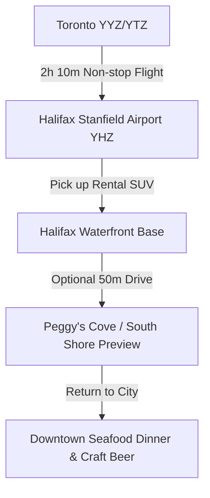

# ✈️ Day 0: Optional Pre-Trip Buffer — Fly Toronto to Halifax & South Shore Exploration

!!! info "Travel Buffer Day (Flexible Date: Thursday Oct 8 or Friday Oct 9, 2026)"
    **Base Camp**: Downtown Halifax Waterfront  
    **Total Driving Distance**: ~80 km to ~180 km (depending on optional South Shore loop)  
    **Primary Goal**: Take advantage of lower weekday flight pricing from Toronto (YYZ/YTZ to YHZ), pick up the rental car without holiday airport rush, and explore the historic Halifax harbor or South Shore.

---

## 🗺️ Day Overview & Flight Transit

Arriving a day or two prior to the Thanksgiving weekend core itinerary unlocks major savings on airfare from Toronto while giving your group a relaxed runway before the drive to Cape Breton.

???+ info "🗺️ Turn-by-Turn Google Maps Navigation Routes"
    Choose your preferred arrival day plan below to launch pre-loaded turn-by-turn navigation in Google Maps:
    
    * **Option A (Halifax Airport & City Waterfront)**: [**👉 Open Option A Route in Google Maps**](https://www.google.com/maps/dir/Halifax+Stanfield+International+Airport+%28YHZ%29%2C+Enfield%2C+NS/Halifax+Citadel+National+Historic+Site%2C+Halifax%2C+NS/Queen%27s+Marque%2C+Lower+Water+Street%2C+Halifax%2C+NS){:target="_blank"} (~38 km, ~40 mins drive)
    * **Option B (South Shore UNESCO Lunenburg Loop)**: [**👉 Open Option B Route in Google Maps**](https://www.google.com/maps/dir/Halifax+Stanfield+International+Airport+%28YHZ%29%2C+Enfield%2C+NS/Old+Town+Lunenburg%2C+Montague+Street%2C+Lunenburg%2C+NS/Three+Churches+Foundation%2C+Edgewater+Street%2C+Mahone+Bay%2C+NS/Downtown+Halifax%2C+Halifax%2C+NS){:target="_blank"} (~205 km, ~2.5 hours total drive)

### 📍 Route Stops Breakdown

#### Option A: Airport Transit & Halifax Highlights
| Stop | Location / Waypoint | Segment Dist & Time | Route Highway | Key Activity & Highlights |
|:---:|:---|:---:|:---|:---|
| **1** | **Halifax Stanfield Airport (YHZ)** | — | NS-102 S | Pick up rental AWD vehicle at lower-level parkade |
| **2** | **Halifax Citadel Historic Site** | 35 km (35 mins) | NS-102 S to Connaught Ave | Panoramic harbor views from perimeter ramparts |
| **3** | **Halifax Waterfront / Queen's Marque** | 3 km (10 mins) | Sackville St to Lower Water St | Check in to hotel, waterfront boardwalk walk & dinner |

#### Option B: South Shore UNESCO Heritage Loop
| Stop | Location / Waypoint | Segment Dist & Time | Route Highway | Key Activity & Highlights |
|:---:|:---|:---:|:---|:---|
| **1** | **Halifax Stanfield Airport (YHZ)** | — | NS-102 S to NS-103 W | Pick up rental car and depart directly southwest |
| **2** | **Old Town Lunenburg** | 105 km (1h 15m) | NS-103 W (Exit 11) | UNESCO 18th-century colorful harbor, Bluenose II berth |
| **3** | **Mahone Bay Three Churches** | 12 km (15 mins) | Route 3 N | Postcard-perfect three church steeples & artisan bakeries |
| **4** | **Downtown Halifax Base** | 88 km (1h 05m) | NS-103 E to NS-102 S | Evening arrival at downtown waterfront accommodations |

---

## ⏱️ Detailed Timeline & Activity Breakdown

### 09:00 AM – 01:00 PM: Flight Departure & Arrival at YHZ
- **09:00 AM – 11:15 AM**: Morning departure from Toronto Pearson (YYZ) or Billy Bishop (YTZ) via Air Canada, Porter, or WestJet.
- **12:15 PM – 01:00 PM (Atlantic Time, +1 hr from Toronto)**: Touchdown at **Halifax Stanfield International Airport (YHZ)**.
- **Airport Car Rental Pick-Up**: Proceed directly to the on-site car rental pavilion on the lower level of the parkade (National, Enterprise, Avis, Hertz). 
- **Logistics Tip**: Inspect your vehicle thoroughly, secure all-wheel-drive/SUV if possible for highlands driving, and sync your offline Google Maps / Apple Maps.

---

### 01:30 PM – 04:30 PM: Option A — Halifax Waterfront & Historic Citadel
*Ideal for a low-key afternoon shaking off the flight.*

- **01:30 PM – 02:15 PM**: Scenic 35-minute drive (35 km) via NS-102 S into downtown Halifax.
- **02:15 PM – 03:30 PM**: **Halifax Waterfront Boardwalk Stroll**
  - **Exertion vs Lounging**: 1.5 km easy paved walk (45 mins walking) + 30 mins harbor watching and visiting Queen's Marque public art installations.
  - **Direct Guide**: [Halifax Waterfront Official Guide](https://discoverhalifaxns.com/plan/halifax-waterfront/)
- **03:30 PM – 04:30 PM**: **Halifax Citadel National Historic Site** (Hilltop Lookout)
  - **Logistics**: Free access to perimeter grounds and panoramic views over Halifax Harbour and Dartmouth. Paid entrance ($13.25/adult) for interior museum exhibits and historical reenactments.
  - **Direct Guide**: [Parks Canada Citadel Site](https://parks.canada.ca/lhn-nhs/ns/halifax)

---

### 01:30 PM – 06:00 PM: Option B — South Shore Heritage Excursion (Lunenburg & Mahone Bay)
*Ideal if arriving early and eager for coastal scenery.*

- **01:30 PM – 02:45 PM**: Drive 105 km (1 hr 15 min) southwest via NS-103 W to **Old Town Lunenburg** (UNESCO World Heritage Site).
- **02:45 PM – 04:15 PM**: **Old Town Lunenburg Architectural Walk & Harbourfront**
  - **Exertion vs Lounging**: 2.0 km gentle uphill/downhill street walk (45 mins) + 45 mins waterfront shipyard browsing and Bluenose II home berth viewing.
  - **Parking**: Metered street parking along Bluenose Drive and Montague Street.
  - **Direct Guide**: [Town of Lunenburg Tourism](https://www.explorelunenburg.ca/)
- **04:30 PM – 05:30 PM**: **Mahone Bay Three Churches & Artisan Shops**
  - **Drive**: 12 km (15 mins) north along Route 3.
  - **Highlights**: View the iconic trio of heritage church steeples mirrored across the calm bay waters; sample fresh cream puffs from *The Barn Coffee & Social House*.
  - **Direct Guide**: [Mahone Bay Tourism](https://mahonebay.com/)
- **05:30 PM – 06:45 PM**: Drive back to Halifax base (85 km, ~1 hr) via NS-103 E.

---

### 07:00 PM – 09:30 PM: Halifax Evening Welcome Feast & Settle In
- Check into Halifax base accommodation (Waterfront or Downtown Core).
- Head out on foot along Lower Water Street or Argyle Street for fresh Atlantic oysters, local craft cider, and classic Maritime fare.

---

## 🍽️ Dining & Restaurant Options

1. **The Bicycle Thief** *(Halifax Waterfront)*  
   - **Drive / Walk**: 5-min walk from waterfront hotels  
   - **Food Type**: North American Italian with fresh Atlantic seafood flair  
   - **Price**: $$$ ($30–$55 CAD per main)  
   - **Google Maps**: [The Bicycle Thief](https://maps.google.com/?q=The+Bicycle+Thief+Halifax)  
   - **Why Recommended**: The flagship restaurant of Bishop’s Landing right on the harbor; signature dishes include pistachio-crusted Atlantic halibut and handmade lobster ravioli. Reservations essential.

2. **Five Fishermen Restaurant** *(Downtown Halifax - Argyle St)*  
   - **Drive / Walk**: 8-min walk from waterfront  
   - **Food Type**: Historic fine seafood & oyster bar  
   - **Price**: $$$–$$$$ ($35–$65 CAD)  
   - **Google Maps**: [The Five Fishermen Halifax](https://maps.google.com/?q=The+Five+Fishermen+Halifax)  
   - **Why Recommended**: Located in a 19th-century building with deep history (Titanic mortuary); world-class Atlantic lobster, snow crab, and fresh Digby scallops.

3. **King of Donair (KOD)** *(Quinpool Road / Downtown)*  
   - **Drive / Walk**: 5-min drive or 20-min walk from downtown  
   - **Food Type**: Authentic Halifax Donair (Official City Food)  
   - **Price**: $ ($10–$18 CAD)  
   - **Google Maps**: [King of Donair Quinpool](https://maps.google.com/?q=King+of+Donair+Quinpool+Road+Halifax)  
   - **Why Recommended**: The original 1973 inventor of the famous Halifax donair—spiced shaved beef, sweet garlic condensed milk sauce, diced tomatoes, and onions on warm pita.

4. **Salt Yard Social / Waterfront Kiosks** *(Halifax Boardwalk)*  
   - **Drive / Walk**: On the Halifax boardwalk  
   - **Food Type**: Casual street eats, lobster rolls, beaver tails, craft beers  
   - **Price**: $$ ($14–$26 CAD)  
   - **Google Maps**: [Halifax Waterfront Boardwalk](https://maps.google.com/?q=Halifax+Waterfront+Boardwalk)  
   - **Why Recommended**: Perfect for a breezy, quick lunch or afternoon snack right on the wharf while watching harbor ferries and sailboats.

5. **The Grand Banker Bar & Grill** *(Lunenburg - If choosing Option B)*  
   - **Drive / Walk**: Located in Lunenburg waterfront  
   - **Food Type**: Contemporary maritime pub & seafood  
   - **Price**: $$–$$$ ($22–$40 CAD)  
   - **Google Maps**: [The Grand Banker Lunenburg](https://maps.google.com/?q=The+Grand+Banker+Bar+and+Grill+Lunenburg)  
   - **Why Recommended**: Overlooking the Lunenburg harbor; famous for the "LunenBurger" (burger topped with lobster & scallops in tarragon butter) and Acadian seafood chowder.

6. **2 Doors Down Food + Wine** *(Downtown Halifax - Barrington St)*  
   - **Drive / Walk**: 6-min walk from Waterfront  
   - **Food Type**: Elevated farm-to-table Nova Scotia bistro  
   - **Price**: $$–$$$ ($24–$38 CAD)  
   - **Google Maps**: [2 Doors Down Halifax](https://maps.google.com/?q=2+Doors+Down+Halifax)  
   - **Why Recommended**: Hyper-local ingredients, incredible smash burgers, smoked pork belly, and local Annapolis Valley wines on tap.

---

## 🎒 Gear & Day Preparation
- **Layered Clothing**: Maritime coastal winds can bring rapid temperature shifts (expect 8°C to 16°C in October). A windproof shell is recommended.
- **Comfortable Walking Shoes**: Paved waterfront boardwalks and cobblestone/historic wooden wharf surfaces.
