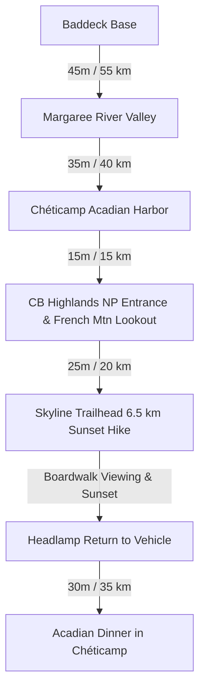

# 🥾 Day 2: Western Cabot Trail, Acadian Coast & The Iconic Skyline Trail Sunset

!!! danger "Highlight Day — Sunday, October 11, 2026"
    **Base Camp**: Chéticamp or Baddeck  
    **Total Driving Distance**: ~145 km (approx. 2.2 – 2.5 hours total drive time)  
    **Primary Goal**: Experience the world-famous Cabot Trail coastal climb, explore Acadian culture in Chéticamp, and hike the iconic **Skyline Trail** during late afternoon and sunset for moose spotting and Gulf of St. Lawrence ocean panoramas.

---

## 🗺️ Route Map & Day Architecture

Today you ascend onto the dramatic western cliffs of the Cabot Trail. The route hugs the Gulf of St. Lawrence, winding through the rolling Margaree salmon river valley, through the Acadian harbor of Chéticamp, up the engineered switchbacks of French Mountain, and culminates with the crown jewel of Nova Scotia hiking—the **Skyline Trail**.

---

## ⏱️ Detailed Timeline & Activity Breakdown

### 08:30 AM – 10:30 AM: Scenic Drive Through Margaree Valley
- **08:30 AM – 09:30 AM**: Depart Baddeck westbound on NS-105 to Trans-Canada Exit 7, joining the Cabot Trail (NS-19 / NS-30 N) into the lush **Margaree Valley**.
- **09:30 AM – 10:30 AM**: **Margaree River & Valley Lookouts**
  - **Exertion vs Lounging**: 15 mins easy riverbank stroll + 45 mins scenic photo stops along the crimson and gold autumn maple banks of the Southwest and Northeast Margaree Rivers.
  - **Highlights**: Stop at the historic Doryman hook or Margaree Salmon Museum; watch traditional fly-anglers casting for Atlantic salmon in pristine autumn pools.
  - **Direct Guide**: [Margaree River Tourism Guide](https://www.novascotia.com/places-to-go/regions/cape-breton/margaree)

---

### 10:45 AM – 01:15 PM: Chéticamp Acadian Culture & Coastal Harbour
- **10:45 AM – 11:30 AM**: Drive north along the rugged coastline into **Chéticamp**, Atlantic Canada’s vibrant Acadian capital.
- **11:30 AM – 01:00 PM**: **Les Trois Pignons Cultural Centre & Harbourfront**
  - **Location**: 15584 Cabot Trail, Chéticamp.
  - **Exertion vs Lounging**: 45 mins gallery walk + 45 mins lunch and harbour admiring.
  - **Highlights**: World-renowned museum of Acadian hooked rugs, traditional rug-hooking master demonstrations, and genealogical archives.
  - **Direct Guide**: [Les Trois Pignons Official Site](https://www.lestroispignons.com/)
- **01:00 PM – 01:30 PM**: Pick up freshly baked Acadian meat pies (*pâté à la viande*) and artisanal bread at *La Boulangerie Aucoin Bakery* to pack for trail snacks.

---

### 01:45 PM – 03:30 PM: Entering Cape Breton Highlands National Park & French Mountain
- **01:45 PM – 02:15 PM**: Pass through the Parks Canada Western Gates at Chéticamp. 
  - **Logistics**: Display your Parks Canada Discovery Pass on your dashboard or pay daily fee ($10.50/adult). Stop briefly at the Chéticamp Visitor Centre for real-time wildlife advisories (moose activity and black bear notices).
- **02:15 PM – 03:15 PM**: **The French Mountain Coastal Switchbacks**
  - **Drive & Lookouts**: Ascend the legendary serpentine mountain pass rising 450 meters (1,475 ft) directly out of the ocean.
  - **Lookout Stops**: Pull over at **Cap Rouge Lookout** and **French Mountain Summit Lookout** for vertigo-inducing cliff-edge photography over the churning Atlantic surf.

---

### 03:45 PM – 07:15 PM: The Iconic Skyline Trail Sunset Hike
*The undisputed signature hike of Nova Scotia.*

- **Trailhead Coordinates**: 46.7410° N, 60.8804° W (Large paved parking area with Parks Canada interpretive panels and pit toilets).
- **Trail Specifications**:
  - **Distance**: 6.5 km out-and-back (direct trail) or 8.2 km loop trail.
  - **Elevation Gain**: ~145 m (gentle undulating gravel path leading to steep descending cliff-side boardwalk stairs).
  - **Difficulty**: Moderate (easy flat walking, followed by 287 wooden steps down to the headland point).
- **Granular Activity Breakdown**:
  - **03:45 PM – 04:45 PM (Active Exertion - 4.0 km walk)**: Hike through boreal spruce forest and highland taiga. Keep eyes peeled across the blueberry scrub—this plateau hosts one of the highest densities of Eastern Canadian Moose in North America.
  - **04:45 PM – 06:15 PM (Stationary Viewpoint & Sunset Spectacle)**: Reach the dramatic headland cliff. Descend the cantilevered wooden staircase extending high above the Gulf of St. Lawrence. Watch fishing boats ply the waters 300 meters below while the sun sinks into the Atlantic horizon in a blaze of purple and gold. Keep binoculars trained for pilot whales and bald eagles cruising the thermal drafts.
  - **06:15 PM – 07:15 PM (Active Exertion - Return Hike)**: Ascend the boardwalk stairs and hike back along the trail as twilight settles. **Headlamps are mandatory** for the final 30 minutes of the return walk.
- **Direct Guides**:
  - [Parks Canada Official Skyline Trail Guide](https://parks.canada.ca/pn-np/ns/cbreton/activ/randonnee-hiking/skyline)
  - [AllTrails Skyline Trail Nova Scotia](https://www.alltrails.com/trail/canada/nova-scotia/skyline-trail)

---

### 07:45 PM – 09:45 PM: Hearty Post-Hike Acadian Dinner & Recovery
- Drive 25 minutes down from French Mountain into Chéticamp for a celebratory Acadian feast featuring fresh crab, lobster, or *fricot* stew.

---

## 🍽️ Dining & Restaurant Options

1. **Restaurant du Vieux Moulin / The Doryman Pub & Grill** *(Chéticamp)*  
   - **Drive / Walk**: In central Chéticamp (25 min drive from Skyline trailhead)  
   - **Food Type**: Authentic Acadian seafood pub & live fiddle music  
   - **Price**: $$–$$$ ($20–$38 CAD)  
   - **Google Maps**: [The Doryman Chéticamp](https://maps.google.com/?q=The+Doryman+Pub+and+Grill+Cheticamp)  
   - **Why Recommended**: The heart of Acadian musical culture in Cape Breton; famous for fresh snow crab dinners, fish & chips, and spirited Saturday/Sunday afternoon and evening fiddle sessions.

2. **L'Ardoise Restaurant & Lounge / Harbour Restaurant** *(Chéticamp Harbour)*  
   - **Drive / Walk**: 25 min drive from Skyline  
   - **Food Type**: Fresh Gulf seafood, Acadian meat pies, and lobster  
   - **Price**: $$–$$$ ($22–$42 CAD)  
   - **Google Maps**: [Harbour Restaurant Cheticamp](https://maps.google.com/?q=Harbour+Restaurant+Cheticamp+NS)  
   - **Why Recommended**: Unmatched panoramic views of the fishing fleet and Chéticamp Island; specializes in traditional *Pâté aux palourdes* (clam pie) and steamed local lobster.

3. **La Boulangerie Aucoin Bakery** *(Chéticamp)*  
   - **Drive / Walk**: 5 min south of Chéticamp entrance  
   - **Food Type**: Traditional French-Acadian bakery & espresso  
   - **Price**: $ ($4–$14 CAD)  
   - **Google Maps**: [Aucoin Bakery Cheticamp](https://maps.google.com/?q=Aucoin+Bakery+Cheticamp+NS)  
   - **Why Recommended**: In operation since 1955; world-famous for fresh cinnamon buns, Acadian meat pies (*pâtés*), cheddar cheese bread, and date turnovers.

4. **Rusty Anchor Restaurant** *(Pleasant Bay - 15 min north of Skyline)*  
   - **Drive / Walk**: 15 min drive north from Skyline Trailhead  
   - **Food Type**: Ocean-view coastal seafood eatery  
   - **Price**: $$–$$$ ($20–$36 CAD)  
   - **Google Maps**: [The Rusty Anchor Pleasant Bay](https://maps.google.com/?q=The+Rusty+Anchor+Pleasant+Bay+NS)  
   - **Why Recommended**: Known as one of the best lobster rolls on the entire Cabot Trail, served with homemade chowder on a cliffside outdoor patio overlooking Pleasant Bay.

5. **Margaree Riverview Restaurant** *(Margaree Forks)*  
   - **Drive / Walk**: Along Cabot Trail in Margaree Valley  
   - **Food Type**: Country homestyle cooking & breakfast  
   - **Price**: $–$$ ($12–$22 CAD)  
   - **Google Maps**: [Margaree Riverview Restaurant](https://maps.google.com/?q=Margaree+Riverview+Restaurant+NS)  
   - **Why Recommended**: Perfect morning comfort stop for blueberry pancakes, bacon, and farm eggs before entering the national park.

6. **Wreck Cove General Store & Café** *(East side return / Snack stop)*  
   - **Drive / Walk**: On eastern Cabot Trail  
   - **Food Type**: Sandwiches, homemade lobster & crab rolls, Cape Breton fudge  
   - **Price**: $–$$ ($10–$20 CAD)  
   - **Google Maps**: [Wreck Cove General Store](https://maps.google.com/?q=Wreck+Cove+General+Store+NS)  
   - **Why Recommended**: Famous roadside hub known for oversized fresh lobster rolls on toasted homemade buns and Cape Breton tartan gifts.

---

## 🎒 Gear & Day Preparation
- **Headlamp / Flashlight (Mandatory)**: If staying on the Skyline boardwalk for sunset, you will be walking the final 2–3 km of forest in darkness. Keep hands free with a dedicated headlamp (300+ lumens).
- **Windproof Outer Shell & Warm Beanie**: The headland plateau is completely exposed to maritime gales; wind chill can drop temps below 4°C rapidly at dusk.
- **Wildlife Awareness**: Moose are massive and frequent the trail margins. Maintain at least 30 meters distance; never approach or corner cows with calves.
