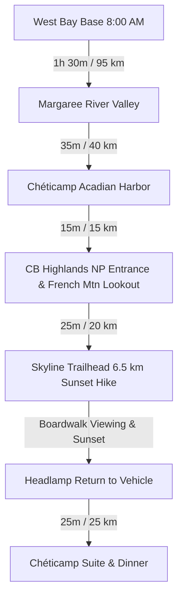

# 🥾 Day 2: Western Cabot Trail, Acadian Coast & The Iconic Skyline Trail Sunset

!!! note "Day 2 — Sunday, October 11, 2026"
    **Base Camp**: **The Sunset Harbour Village Suite (15294 Cabot Trail A, Chéticamp) — 🟢 BOOKED (Airbnb #HM3Y8BH355)**  
    **Total Driving Distance**: ~170 km (approx. 2.5 – 3 h total drive time)  
    **Primary Goal**: Depart the Bras d'Or Lake, wind through the **Margaree Valley**, explore Acadian culture in **Chéticamp**, and hike the iconic **Skyline Trail** at sunset for moose spotting and Gulf of St. Lawrence ocean panoramas — then sleep 20 minutes from the trailhead.

!!! success "🏨 Accommodation BOOKED — The Sunset Harbour Village Suite, Chéticamp"
    **Sun, Oct 11 night**: 15294 Cabot Trail A, Chéticamp, NS B0E 1H0. Airbnb Reservation **#HM3Y8BH355** (Host Joeleen). Check-in: Sun Oct 11 @ 4:00 PM; Check-out: Mon Oct 12 @ 10:00 AM. 2 guests.  
    - **Trail Proximity**: Right on the Cabot Trail in Chéticamp — only **20 minutes south of the Skyline trailhead**.  
    - **Moose-Safety Advantage**: Eliminates the dangerous 1.5–2 h night drive through highlands moose territory after the sunset hike.  
    - **Dining**: A short walk or drive to **L'Abri** or **The Doryman**. *(Receipt: `receipts/hotel_10_11.pdf`)*

---

## 🗺️ Route Map & Day Architecture

Today you ascend onto the dramatic western cliffs of the Cabot Trail. The route hugs the Gulf of St. Lawrence, winding through the rolling Margaree salmon river valley, through the Acadian harbor of Chéticamp, up the engineered switchbacks of French Mountain, and culminates with the crown jewel of Nova Scotia hiking—the **Skyline Trail**.

???+ info "🗺️ Turn-by-Turn Google Maps Navigation Route"
    **Direct Navigation Link**: [**🔗 Open Day 2 Route in Google Maps**](https://www.google.com/maps/dir/108+Camerons+Road%2C+West+Bay%2C+NS/Margaree+Forks%2C+NS/Les+Trois+Pignons%2C+Cabot+Trail%2C+Ch%C3%A9ticamp%2C+NS/Cap+Rouge+Lookout%2C+Cabot+Trail%2C+Ch%C3%A9ticamp%2C+NS/Skyline+Trail+Trailhead%2C+Cabot+Trail%2C+Cape+Breton+Highlands+National+Park%2C+NS/15294+Cabot+Trail%2C+Ch%C3%A9ticamp%2C+NS){:target="_blank"} (~170 km, ~2 h 45 m total drive)  
    *Click to launch live GPS turn-by-turn navigation from West Bay through the Margaree Valley to the Skyline Trail and your Chéticamp suite.*

### 📍 Route Stops Breakdown

| Stop | Location / Waypoint | Segment Dist & Time | Route Highway | Key Highlights & Actions |
|:---:|:---|:---:|:---|:---|
| **1** | **The Shoreline, West Bay (Base)** | — | West Bay Rd → NS-105 W | Morning departure west along the Bras d'Or lakeshore via Whycocomagh |
| **2** | **Margaree River Valley** | 95 km (1 h 30 m) | NS-105 W → Cabot Trail (NS-19) | Salmon pools, autumn maple ridges, Margaree Forks lookouts |
| **3** | **Les Trois Pignons (Chéticamp)** | 40 km (35 mins) | Cabot Trail (NS-30 N) | Acadian hooked rug museum, Aucoin Bakery meat pies & provisions |
| **4** | **Cap Rouge Lookout** | 15 km (15 mins) | Cabot Trail (Parks Entry) | Coastal switchback ocean panoramas & French Mountain climb |
| **5** | **Skyline Trail Trailhead** | 20 km (25 mins) | Cabot Trail (Highlands) | 6.5 km sunset boardwalk hike, moose viewing (⚡ 4:00 PM booked slot) |
| **6** | **Chéticamp Harbour & The Doryman** | 35 km (30 mins) | Cabot Trail south | Evening Acadian seafood dinner, local snow crab & live fiddle music |

```mermaid
graph TD
    A[West Bay Base 8:00 AM] -->|1h 30m / 95 km| B[Margaree River Valley]
    B -->|35m / 40 km| C[Chéticamp Acadian Harbor]
    C -->|15m / 15 km| D[CB Highlands NP Entrance & French Mtn Lookout]
    D -->|25m / 20 km| E[Skyline Trailhead 6.5 km Sunset Hike]
    E -->|Boardwalk Viewing & Sunset| F[Headlamp Return to Vehicle]
    F -->|25m / 25 km| G[Chéticamp Suite & Dinner]
```
---

## ⏱️ Detailed Timeline & Activity Breakdown

### 08:00 AM – 10:15 AM: Scenic Drive Through Margaree Valley
- **08:00 AM – 09:40 AM**: Check out the West Bay base and depart west on **NS-105**, turning onto the **Cabot Trail (NS-19)** at the Margaree junction into the lush **Margaree Valley** (95 km, ~1 h 30 m).
- **09:40 AM – 10:15 AM**: **Margaree River & Valley Lookouts**
  - **Effort**: 15 mins easy riverbank stroll + 45 mins of scenic photo stops along the crimson and gold autumn maple banks of the Southwest and Northeast Margaree Rivers.
  - **Highlights**: Stop at the Margaree Salmon Museum; watch traditional fly-anglers casting for Atlantic salmon in pristine autumn pools.
  - **Direct Guide**: [Margaree River Tourism Guide](https://www.novascotia.com/places-to-go/regions/cape-breton/margaree)

---

### 10:30 AM – 01:15 PM: Chéticamp Acadian Culture & Coastal Harbour
- **10:30 AM – 11:15 AM**: Drive north along the rugged coastline into **Chéticamp**, Atlantic Canada’s vibrant Acadian capital (40 km, ~40 mins).
- **11:15 AM – 01:00 PM**: **Les Trois Pignons Cultural Centre & Harbourfront**
  - **Location**: 15584 Cabot Trail, Chéticamp.
  - **Effort & Timing**: 45 mins gallery walk + 45 mins lunch and harbour admiring.
  - **Highlights**: World-renowned museum of Acadian hooked rugs, traditional rug-hooking master demonstrations, and genealogical archives.
  - **Direct Guide**: [Les Trois Pignons Official Site](https://www.lestroispignons.com/)
- **01:00 PM – 01:30 PM**: Pick up freshly baked Acadian meat pies (*pâté à la viande*) and artisanal bread at *La Boulangerie Aucoin Bakery* to pack for trail snacks.

---

### 01:45 PM – 03:30 PM: Entering Cape Breton Highlands National Park & French Mountain
- **01:45 PM – 02:15 PM**: Pass through the Parks Canada Western Gates at Chéticamp. 
  - **Logistics**: Display your Parks Canada Discovery Pass on your dashboard or pay daily fee ($10.50/adult). Stop briefly at the Chéticamp Visitor Centre for real-time wildlife advisories (moose activity and black bear notices).
- **02:15 PM – 03:15 PM**: **The French Mountain Coastal Switchbacks**
  - **Drive & Lookouts**: Ascend the legendary serpentine mountain pass rising 450 meters (1,475 ft) directly out of the ocean.
  - **Lookout Stops**: Pull over at **Cap Rouge Lookout** and **French Mountain Summit Lookout** for vertigo-inducing cliff-edge photography over the churning Atlantic surf.

---

### 03:45 PM – 07:15 PM: The Iconic Skyline Trail Sunset Hike
*The undisputed signature hike of Nova Scotia.*

- **Trailhead Coordinates**: 46.7410° N, 60.8804° W (Large paved parking area with Parks Canada interpretive panels and pit toilets).
- **✅ Parking Reservation Confirmed**:
  - **Status**: 🟢 **Booked & Confirmed** for **Sunday, October 11, 2026** *(Check-in: 4:00 PM / 16:00 slot)* via Parks Canada Reservation Service.
  - **Arrival Window**: Arrive at the trailhead between **03:50 PM and 05:00 PM** (within 1 hour of the 4:00 PM check-in).
  - **Offline Confirmation**: Cellular reception is non-existent on French Mountain. Ensure the receipt PDF (`receipts/skyline.pdf`, Conf. INPC26-60130188B1) or screenshot is saved on your phone prior to entering the park.
- **Trail Specifications**:
  - **Distance**: 6.5 km out-and-back (direct trail) or 8.2 km loop trail.
  - **Elevation Gain**: ~145 m (gentle undulating gravel path leading to steep descending cliff-side boardwalk stairs).
  - **Difficulty**: Moderate (easy flat walking, followed by 287 wooden steps down to the headland point).
- **Granular Activity Breakdown**:
  - **03:45 PM – 04:45 PM (Active Exertion - 4.0 km walk)**: Hike through boreal spruce forest and highland taiga. Keep eyes peeled across the blueberry scrub—this plateau hosts one of the highest densities of Eastern Canadian Moose in North America.
  - **04:45 PM – 06:15 PM (Stationary Viewpoint & Sunset Spectacle)**: Reach the dramatic headland cliff. Descend the cantilevered wooden staircase extending high above the Gulf of St. Lawrence. Watch fishing boats ply the waters 300 meters below while the sun sinks into the Atlantic horizon in a blaze of purple and gold. Keep binoculars trained for pilot whales and bald eagles cruising the thermal drafts.
  - **06:15 PM – 07:15 PM (Active Exertion - Return Hike)**: Ascend the boardwalk stairs and hike back along the trail as twilight settles. **Headlamps are mandatory** for the final 30 minutes of the return walk.
- **Direct Guides**:
  - [Parks Canada Official Skyline Trail Guide](https://parks.canada.ca/pn-np/ns/cbreton/activ/randonnee-hiking/skyline)
  - [AllTrails Skyline Trail Nova Scotia](https://www.alltrails.com/trail/canada/nova-scotia/skyline-trail)

---

### 07:45 PM – 09:45 PM: Chéticamp Dinner at L'Abri (✅ LOCKED)
- Drive 25 minutes down from French Mountain into Chéticamp for a celebratory Acadian feast at **L'Abri Restaurant & Bar** — fresh local seafood, Acadian-inspired plates, craft cocktails, and gluten-free-friendly options. (Fall hours — call ahead to confirm evening service on the holiday weekend.)

---

## 🍽️ Dining & Restaurant Options

1. **L'Abri Restaurant & Bar** *(Chéticamp — dinner, ✅ LOCKED)*  
   - **Drive / Walk**: On the Cabot Trail through Chéticamp (25 min drive from Skyline trailhead)  
   - **Food Type**: Modern Acadian cuisine, fresh Gulf seafood, craft cocktails — gluten-free friendly  
   - **Price**: $$–$$$ ($20–$40 CAD)  
   - **Google Maps**: [L'Abri Restaurant & Bar Chéticamp](https://maps.google.com/?q=Labri+Restaurant+and+Bar+Cheticamp+NS)  
   - **Why Recommended**: Your locked post-Skyline dinner — consistently the best-reviewed restaurant in Chéticamp, doing elevated Acadian plates and great cocktails on the main drag; the festive *fricot*, crab, and outdoor-patio buzz make it the right send-off to the Skyline day.

2. **Restaurant du Vieux Moulin / The Doryman Pub & Grill** *(Chéticamp)*  
   - **Drive / Walk**: In central Chéticamp (25 min drive from Skyline trailhead)  
   - **Food Type**: Authentic Acadian seafood pub & live fiddle music  
   - **Price**: $$–$$$ ($20–$38 CAD)  
   - **Google Maps**: [The Doryman Chéticamp](https://maps.google.com/?q=The+Doryman+Pub+and+Grill+Cheticamp)  
   - **Why Recommended**: The heart of Acadian musical culture in Cape Breton; famous for fresh snow crab dinners, fish & chips, and spirited Saturday/Sunday afternoon and evening fiddle sessions.

3. **L'Ardoise Restaurant & Lounge / Harbour Restaurant** *(Chéticamp Harbour)*  
   - **Drive / Walk**: 25 min drive from Skyline  
   - **Food Type**: Fresh Gulf seafood, Acadian meat pies, and lobster  
   - **Price**: $$–$$$ ($22–$42 CAD)  
   - **Google Maps**: [Harbour Restaurant Cheticamp](https://maps.google.com/?q=Harbour+Restaurant+Cheticamp+NS)  
   - **Why Recommended**: Unmatched panoramic views of the fishing fleet and Chéticamp Island; specializes in traditional *Pâté aux palourdes* (clam pie) and steamed local lobster.

4. **La Boulangerie Aucoin Bakery** *(Chéticamp)*  
   - **Drive / Walk**: 5 min south of Chéticamp entrance  
   - **Food Type**: Traditional French-Acadian bakery & espresso  
   - **Price**: $ ($4–$14 CAD)  
   - **Google Maps**: [Aucoin Bakery Cheticamp](https://maps.google.com/?q=Aucoin+Bakery+Cheticamp+NS)  
   - **Why Recommended**: In operation since 1955; world-famous for fresh cinnamon buns, Acadian meat pies (*pâtés*), cheddar cheese bread, and date turnovers.

5. **Rusty Anchor Restaurant** *(Pleasant Bay - 15 min north of Skyline)*  
   - **Drive / Walk**: 15 min drive north from Skyline Trailhead  
   - **Food Type**: Ocean-view coastal seafood eatery  
   - **Price**: $$–$$$ ($20–$36 CAD)  
   - **Google Maps**: [The Rusty Anchor Pleasant Bay](https://maps.google.com/?q=The+Rusty+Anchor+Pleasant+Bay+NS)  
   - **Why Recommended**: Known as one of the best lobster rolls on the entire Cabot Trail, served with homemade chowder on a cliffside outdoor patio overlooking Pleasant Bay.

6. **Margaree Riverview Restaurant** *(Margaree Forks)*  
   - **Drive / Walk**: Along Cabot Trail in Margaree Valley  
   - **Food Type**: Country homestyle cooking & breakfast  
   - **Price**: $–$$ ($12–$22 CAD)  
   - **Google Maps**: [Margaree Riverview Restaurant](https://maps.google.com/?q=Margaree+Riverview+Restaurant+NS)  
   - **Why Recommended**: Perfect morning comfort stop for blueberry pancakes, bacon, and farm eggs before entering the national park.

7. **Wreck Cove General Store & Café** *(East side return / Snack stop)*  
   - **Drive / Walk**: On eastern Cabot Trail  
   - **Food Type**: Sandwiches, homemade lobster & crab rolls, Cape Breton fudge  
   - **Price**: $–$$ ($10–$20 CAD)  
   - **Google Maps**: [Wreck Cove General Store](https://maps.google.com/?q=Wreck+Cove+General+Store+NS)  
   - **Why Recommended**: Famous roadside hub known for oversized fresh lobster rolls on toasted homemade buns and Cape Breton tartan gifts.

---

## 🎒 Gear & Day Preparation
- **Headlamp / Flashlight (Mandatory)**: If staying on the Skyline boardwalk for sunset, you will be walking the final 2–3 km of forest in darkness. Keep hands free with a dedicated headlamp (300+ lumens).
- **Windproof Outer Shell & Warm Beanie**: The headland plateau is completely exposed to maritime gales; wind chill can drop temps below 4°C rapidly at dusk.
- **Wildlife Awareness**: Moose are massive and frequent the trail margins. Maintain at least 30 meters distance; never approach or corner cows with calves.
