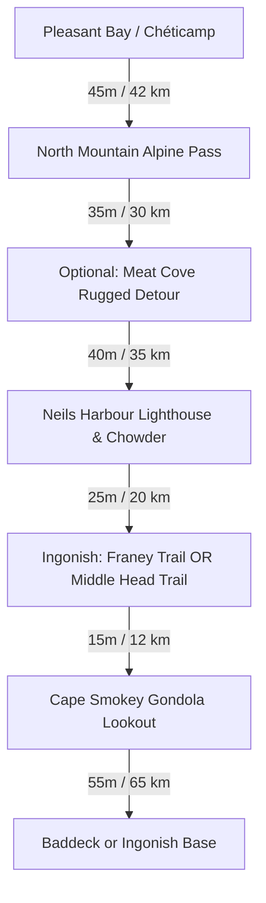

# ⛰️ Day 3: Northern Highlands, Meat Cove Cliffs & The Eastern Coast of Ingonish

!!! success "Core Itinerary Day 3 (Thanksgiving Monday) — October 12, 2026"
    **Base Camp**: Ingonish or Baddeck  
    **Total Driving Distance**: ~160 km to ~210 km (with Meat Cove northern excursion)  
    **Primary Goal**: Traverse the alpine northern highlands of Cape Breton, stand atop the wild cliffs of Meat Cove, conquer the panoramic **Franey Mountain Trail** or **Middle Head Trail**, and ride the **Cape Smokey Gondola**.

---

## 🗺️ Route Map & Overview

Today covers the most alpine and rugged stretches of the Cabot Trail. You cross MacKenzie Mountain and North Mountain, cut across the top of Cape Breton Island into Aspy Bay, explore the isolated northern cliffs of **Meat Cove**, and descend along the pink granite coastline of **Ingonish**.

???+ info "🗺️ Turn-by-Turn Google Maps Navigation Route"
    **Direct Navigation Link**: [**👉 Open Day 3 Route in Google Maps**](https://www.google.com/maps/dir/Ch%C3%A9ticamp%2C+NS/MacKenzie+Mountain+Lookout%2C+Cabot+Trail%2C+NS/Meat+Cove+Chowder+Hut%2C+Meat+Cove+Road%2C+Meat+Cove%2C+NS/Neils+Harbour+Lighthouse%2C+Neils+Harbour%2C+NS/Franey+Trailhead%2C+Franey+Road%2C+Ingonish+Centre%2C+NS/Cape+Smokey+Gondola%2C+Cabot+Trail%2C+Ingonish+Ferry%2C+NS/Baddeck%2C+NS){:target="_blank"} (~215 km, ~3h 30m total drive)  
    *Click to launch live GPS turn-by-turn navigation pre-routed from Chéticamp across North Mountain, up to Meat Cove, down through Ingonish, and returning to Baddeck.*

### 📍 Route Stops Breakdown

| Stop | Location / Waypoint | Segment Dist & Time | Route Highway | Key Highlights & Actions |
|:---:|:---|:---:|:---|:---|
| **1** | **Chéticamp Base** | — | Cabot Trail (NS-30 N) | Morning departure into the national park northern alpine loop |
| **2** | **MacKenzie & North Mtn Lookouts** | 42 km (45 mins) | Cabot Trail | Alpine summit passes (elev. 445m), autumn canyon foliage vistas |
| **3** | **Meat Cove Sea Cliffs** | 30 km (35 mins) | Bay St. Lawrence Rd & Meat Cove Rd | Isolated northern tip, vertical grassy sea cliffs, cliffside Chowder Hut |
| **4** | **Neils Harbour Lighthouse** | 35 km (40 mins) | Cabot Trail south | 1899 wooden lighthouse, operating lobster slipway, hot chowder |
| **5** | **Franey Trailhead / Middle Head** | 20 km (25 mins) | Cabot Trail to Franey Rd / Keltic | Conquer 7.4 km Franey summit or 3.8 km Middle Head peninsula hike |
| **6** | **Cape Smokey Gondola** | 12 km (15 mins) | Cabot Trail south | Atlantic Canada's only gondola; 320m timber skywalk ocean panorama |
| **7** | **Baddeck Village Base** | 65 km (55 mins) | Cabot Trail & NS-105 S | Return via St. Ann's Bay to Baddeck for Thanksgiving dinner |

---

## ⏱️ Detailed Timeline & Activity Breakdown

### 08:30 AM – 10:30 AM: Alpine Crossing & North Mountain Lookouts
- **08:30 AM – 09:45 AM**: Drive east from Pleasant Bay over **MacKenzie Mountain** and **North Mountain** via NS-30 (Cabot Trail).
  - **Lookout Stops**: Pull off at **MacKenzie Mountain Lookout** and **North Mountain Summit** (elev. 445m / 1,460 ft).
  - **Exertion vs Lounging**: 15 mins easy viewing platform strolls + 30 mins photography overlooking the sheer canyons of the Big Intervale and Aspy River Valley blanketed in fiery orange and gold autumn foliage.

---

### 10:30 AM – 01:00 PM: Meat Cove — The Edge of the Island
*Cape Breton’s wildest, most remote coastal settlement.*

- **10:30 AM – 11:15 AM**: Drive 35 km north off the Cabot Trail from Cape North along the rugged coastal road through Bay St. Lawrence to **Meat Cove** (final 8 km is well-maintained gravel).
- **11:15 AM – 12:45 PM**: **Explore Meat Cove Sea Cliffs & Beach**
  - **Location**: Meat Cove Road, Victoria County (47.0264° N, 60.5593° W).
  - **Exertion vs Lounging**: 1.5 km moderate cliffside trail walk (45 mins) + 45 mins ocean wave watching and lunch at the cliff-edge Chowder Hut.
  - **Highlights**: Towering grassy ocean promontories dropping 150 meters vertically into the North Atlantic, jagged sea stacks, and wild untamed coast.
  - **Direct Guide**: [Meat Cove Cape Breton Guide](https://www.novascotia.com/places-to-go/regions/cape-breton/meat-cove)
- **12:45 PM – 01:30 PM**: Drive back south (35 km) to rejoin the Cabot Trail at South Harbour / Dingwall.

---

### 01:45 PM – 02:45 PM: Neils Harbour Lighthouse & Coastal Break
- **01:45 PM – 02:45 PM**: **Neils Harbour Lighthouse & Lobster Shack**
  - **Location**: Lighthouse Road, Neils Harbour (46.8122° N, 60.3236° W).
  - **Exertion vs Lounging**: 10 mins easy walk around the lighthouse and wooden lobster boat slipway + 35 mins sampling hot chowder or ice cream right on the headland.
  - **Highlights**: Traditional wooden 1899 lighthouse perched above Atlantic breakers with lobster traps stacked high along the wharf.

---

### 03:00 PM – 06:00 PM: Choose Your Ingonish Hiking Adventure

#### Option 1: Franey Mountain Trail (The High-Elevation Peak)
*Recommended for hikers wanting 360-degree fall foliage panoramas.*
- **Trailhead**: Franey Road off Cabot Trail, Ingonish Centre (46.6669° N, 60.4283° W).
- **Trail Stats**: 7.4 km loop | 365 m elevation gain | 2.5 – 3.0 hours total duration.
- **Breakdown**: 2 hours steady uphill climb on switchbacked trails (Hard/Challenging) + 45 mins at the summit wooden viewing platform gazing out over the Clyburn Brook canyon, Middle Head, and the open Atlantic.
- **Direct Guide**: [Parks Canada Franey Trail Official Guide](https://parks.canada.ca/pn-np/ns/cbreton/activ/randonnee-hiking/franey) | [AllTrails Franey Trail](https://www.alltrails.com/trail/canada/nova-scotia/franey-trail)

#### Option 2: Middle Head Trail (The Ocean Headland Peninsula)
*Recommended for a relaxed, coastal-level hike with seal spotting.*
- **Trailhead**: Beyond Keltic Lodge parking lot, Ingonish Beach (46.6575° N, 60.3802° W).
- **Trail Stats**: 3.8 km out-and-back | 85 m elevation gain | 1.5 – 2.0 hours total duration.
- **Breakdown**: 1 hour brisk walk on a narrow peninsula dividing Ingonish North Bay and South Bay + 30 mins sitting on the rocky headland tip watching seabirds and grey seals.
- **Direct Guide**: [Parks Canada Middle Head Guide](https://parks.canada.ca/pn-np/ns/cbreton/activ/randonnee-hiking/middle-head)

---

### 06:15 PM – 07:15 PM: Cape Smokey Gondola & Coastal Lookouts
- **06:15 PM – 07:15 PM**: **Cape Smokey Mountain Summit**
  - **Location**: 38539 Cabot Trail, Ingonish Ferry (46.6200° N, 60.4100° W).
  - **Exertion vs Lounging**: 8-minute scenic gondola ride + 30 mins walking the summit timber skywalk looking south across Ingonish Harbour and Smokey Mountain Headland.
  - **Direct Guide**: [Cape Smokey Destination Site](https://capesmokey.ca/)

---

### 07:30 PM – 09:30 PM: Thanksgiving Maritime Dinner & Evening Relaxation
- Settle in for a traditional Thanksgiving harvest dinner or seafood feast in Ingonish or Baddeck.

---

## 🍽️ Dining & Restaurant Options

1. **The Chowder Hut at Meat Cove** *(Meat Cove Sea Cliffs)*  
   - **Drive / Walk**: At the trailhead in Meat Cove  
   - **Food Type**: Rustic coastal chowder, mussels, and lobster sandwiches  
   - **Price**: $$ ($16–$30 CAD)  
   - **Google Maps**: [Meat Cove Chowder Hut](https://maps.google.com/?q=Meat+Cove+Chowder+Hut+NS)  
   - **Why Recommended**: The northernmost eatery in Nova Scotia, perched literally on the cliff’s edge; legendary creamy seafood chowder with unencumbered ocean views.

2. **The Chowder House at Neils Harbour** *(Neils Harbour)*  
   - **Drive / Walk**: Beside Neils Harbour Lighthouse  
   - **Food Type**: Down-home seafood shack, fresh crab and lobster  
   - **Price**: $$ ($18–$34 CAD)  
   - **Google Maps**: [Chowder House Neils Harbour](https://maps.google.com/?q=The+Chowder+House+Neils+Harbour+NS)  
   - **Why Recommended**: Directly adjacent to the working fishing wharf; renowned for hot buttered lobster rolls, local crab dinners, and steamed soft-shell clams.

3. **Purple Thistle Dining Room at Keltic Lodge** *(Ingonish Beach)*  
   - **Drive / Walk**: 2-min drive from Middle Head trailhead  
   - **Food Type**: Elegant historic fine dining & Thanksgiving menus  
   - **Price**: $$$–$$$$ ($36–$65 CAD)  
   - **Google Maps**: [Keltic Lodge Ingonish](https://maps.google.com/?q=Keltic+Lodge+at+the+Highlands+Ingonish)  
   - **Why Recommended**: Premier historic resort dining on the Middle Head peninsula; offers pan-roasted Atlantic salmon, prime rib, and decadent Nova Scotia berry desserts.

4. **Coastal Restaurant & Pub** *(Ingonish)*  
   - **Drive / Walk**: On Cabot Trail in Ingonish  
   - **Food Type**: Famous burgers, fish tacos, and maritime pub food  
   - **Price**: $$ ($15–$28 CAD)  
   - **Google Maps**: [The Coastal Restaurant Ingonish](https://maps.google.com/?q=The+Coastal+Restaurant+and+Pub+Ingonish)  
   - **Why Recommended**: Home of the "Ringer Burger" (featured on Food Network's *You Gotta Eat Here!*), hearty seafood chowder, and local Big Spruce craft beer.

5. **Danena's Bakery & Bistro** *(South Harbour / Dingwall)*  
   - **Drive / Walk**: 5-min off Cabot Trail near Cape North  
   - **Food Type**: Gourmet sandwiches, freshly baked pastries, wood-fired pizza  
   - **Price**: $$ ($14–$26 CAD)  
   - **Google Maps**: [Danenas Bakery South Harbour](https://maps.google.com/?q=Danenas+Bakery+South+Harbour+NS)  
   - **Why Recommended**: A hidden culinary oasis in northern Cape Breton; organic ingredients, flaky croissants, homemade focaccia, and exceptional espresso.

6. **Main Street Diner / Arduaine Restaurant** *(Ingonish / Baddeck transit)*  
   - **Drive / Walk**: Ingonish main strip  
   - **Food Type**: Casual Nova Scotia diner fare & homemade pies  
   - **Price**: $–$$ ($12–$22 CAD)  
   - **Google Maps**: [Main Street Diner Ingonish](https://maps.google.com/?q=Ingonish+Diner+NS)  
   - **Why Recommended**: Warm hospitality, generous fish and chips, and fresh-baked autumn apple crumble.

---

## 🎒 Gear & Day Preparation
- **Sturdy Hiking Boots**: The Franey Trail features rocky, rooted terrain with significant incline and possible damp sections after autumn rains.
- **Trekking Poles**: Highly recommended for the steep 365m descent on Franey Mountain to protect knees.
- **Binoculars**: Crucial for spotting minke/pilot whales off Meat Cove and Middle Head, as well as bald eagles along the coastal cliffs.
