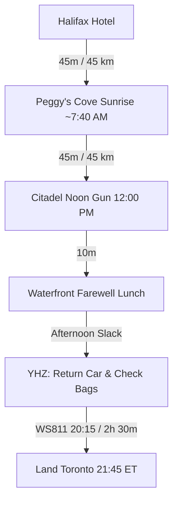

# 🌅 Day 5 (Wed, Oct 14): Peggy's Cove Sunrise, Noon Gun & Evening Return Flight (WS811)

!!! success "Final Day (Return to Toronto) — Wednesday, October 14, 2026"
    **Base Camp**: Downtown Halifax → **Halifax Stanfield Airport (YHZ)**  
    **Total Driving Distance**: ~135 km (Peggy's Cove round-trip + YHZ transit)  
    **Primary Goal**: Keep Wednesday as unhurried **Peggy's Cove & Halifax area time** — the **20:15 flight means the day does NOT need an early start** (you only need to be at YHZ ~18:15). A 6:45 AM sunrise arrival is an optional photographer's bonus, not a requirement.

!!! success "✈️ Return Flight BOOKED — WestJet WS811"
    **Wed, Oct 14 · 20:15 Halifax (YHZ) → 21:45 Toronto-Pearson (YYZ)** · Non-stop 2h 30m · Boeing 737 MAX 8 · Reservation **OEFTZF** · UltraBasic fare, $226.76 paid. *(Receipt: `receipts/WestJet.pdf`)*.  
    ⚠️ **UltraBasic = 1 personal item only — NO carry-on and NO checked bag included.** Add a **checked bag (mandatory for the Grohmann knives + wine) via WestJet Manage Trips** well before departure. The 20:15 departure also means the evening arrives at YYZ 21:45 (ET) — plan for a late night home.

---

## 🗺️ Route Map & Overview

Your last day belongs to the coast and the fortress: an early run down the winding Lighthouse Route (Route 333) to watch the sun clear the Atlantic over the granite boulders of Peggy's Cove, back to the Citadel's **12:00 noon gun**, a proper farewell lunch, a relaxed afternoon, and the airport for the evening flight.

> **Day-5 scope**: ✅ Peggy's Cove sunrise · ✅ Citadel perimeter + noon gun (restored — evening flight) · ✅ Farewell sit-down lunch · ✅ Afternoon slack · ✅ WS811 20:15 flight. ❌ Maritime Museum (done Friday evening) · ❌ Alexander Keith's tour (still cut — see note below).

???+ info "🗺️ Turn-by-Turn Google Maps Navigation Route"
    **Direct Navigation Link**: [**👉 Open Day 5 Route in Google Maps**](https://www.google.com/maps/dir/Downtown+Halifax%2C+Halifax%2C+NS/Peggy%27s+Point+Lighthouse%2C+Peggy%27s+Point+Road%2C+Peggy%27s+Cove%2C+NS/Halifax+Citadel+National+Historic+Site%2C+Halifax%2C+NS/Queen%27s+Marque%2C+Lower+Water+Street%2C+Halifax%2C+NS/Halifax+Stanfield+International+Airport+%28YHZ%29%2C+Enfield%2C+NS){:target="_blank"} (~150 km, ~2h 30m total drive)  
    *Click to launch live GPS navigation: Halifax → Peggy's Cove (sunrise) → Citadel Hill (noon gun) → waterfront farewell lunch → Halifax Stanfield Airport (YHZ).*

### 📍 Route Stops Breakdown

| Stop | Location / Waypoint | Segment Dist & Time | Route Highway | Key Highlights & Actions |
|:---:|:---|:---:|:---|:---|
| **1** | **Downtown Halifax Hotel** | — | NS-333 W | Pre-dawn departure on the Lighthouse Route |
| **2** | **Peggy's Point Lighthouse** | 45 km (45 mins) | Route 333 (Prospect Rd) | 🌅 **Sunrise ~7:40 AM** over the granite boulders — beat every tour bus |
| **3** | **Halifax Citadel Perimeter & Noon Gun** | 45 km (45 mins) | Route 333 to Citadel Hill | ✅ Restored: free ramparts + **12:00 PM noon gun** (interior exhibits cut) |
| **4** | **Waterfront Farewell Lunch** | 10 mins | Citadel Hill → Waterfront | Sit-down farewell feast on the boardwalk |
| **5** | **Halifax Stanfield Airport (YHZ)** | 38 km (40 mins) | NS-102 N | Refuel, return rental car, **add/check bags** (Grohmann knives MUST be checked), security |
| **6** | **Toronto-Pearson (YYZ)** | Flight 2h 30m | WS811 20:15 | Evening non-stop home; arrive 21:45 ET |

---

## ⏱️ Detailed Timeline — Two Ways to Play Wednesday

!!! note "🕐 The day is yours"
    **WS811 departs 20:15** — you only need to hand the car back / reach YHZ by ~**18:00–18:15** (2 h before departure). That makes Day 5 the most relaxed day of the trip. Pick a mode:
    - **🌅 Sunrise mode**: depart 6:45 AM → Peggy's 7:30–10:00 (sunrise ~7:40) → Citadel noon gun → lunch → YHZ 5:45. *(For photographers; current detailed timeline below.)*
    - **😴 Relaxed mode**: sleep in, leave ~9:30 AM → Peggy's 10:30–12:30 midday → lunch → afternoon boardwalk (or Citadel noon gun first, Peggy's after) → YHZ ~5:00–5:45. **Nova Glamping variant**: 8:00 AM boat off the island → Peggy's ~8:35 AM → noon gun → lunch → YHZ ~5:45.
    - **Only hard rules**: at the Citadel by ~11:45 if you want the noon gun; at YHZ by ~18:00–18:15 for WS811.

### 06:45 AM – 10:00 AM: 🌅 Sunrise Mode — Peggy's Point Lighthouse at Dawn
*Sunrise in mid-October is ~7:40 AM — you'll have the lighthouse to yourselves before the tour buses roll in.*

- **06:45 AM – 07:30 AM**: Depart downtown Halifax via NS-333 W (Prospect Road) in the pre-dawn light (45 km). Car stays packed — after lunch you go straight to the airport.
- **07:30 AM – 10:00 AM**: **Peggy's Point Lighthouse & Ancient Granite Formations**
  - **Location**: 72 Peggy's Point Rd, Peggy's Cove (44.4930° N, 63.9181° W).
  - **Exertion vs Lounging**: 1.5 km walking on granite slabs and accessible viewing deck (45 mins) + 1h 45m sunrise photography, the working dory fishing cove, and the William E. deGarthe Fishermen's Monument.
  - **Safety Warning**: ⚠️ **Stay off the black, wet rocks!** Rogue waves are frequent and dangerous. Always remain on the dry white granite boulders or the accessible viewing deck.
  - **Breakfast**: Sou'Wester Restaurant opens at the lighthouse for coffee and their famous gingerbread with lemon sauce.
  - **Direct Guide**: [Peggy's Cove Nova Scotia Tourism](https://www.novascotia.com/see-do/attractions/peggys-point-lighthouse/1468)

### 10:00 AM – 12:15 PM: Back to Halifax & Citadel Noon Gun (✅ RESTORED)
- **10:00 AM – 10:45 AM**: Drive back to downtown Halifax via Route 333.
- **11:00 AM – 12:15 PM**: **Halifax Citadel National Historic Site** — free **perimeter ramparts** walk and the historic **12:00 PM noon gun** with harbour views. *(The 20:15 flight means no clock pressure — this stop is back on Day 5. Paid interior exhibits remain cut.)*
  - **Direct Guide**: [Parks Canada Halifax Citadel](https://parks.canada.ca/lhn-nhs/ns/halifax)

### 12:15 PM – 01:30 PM: Farewell Sit-Down Lunch (✅ RESTORED)
- Proper final meal on the Halifax waterfront or Argyle Street — no rush now (options below). Call ahead to confirm kitchen hours around the lunch rush.

### 01:30 PM – 05:45 PM: Relaxed Afternoon Slack
- Boardwalk wander, last harbour photos, final souvenir stop (or hotel lounge if you checked out).
- *Optional add-on — **your call** (stays cut until you say otherwise): the **Alexander Keith's 1820 Brewery Tour** could now fit (tours run through ~4:30 PM) given the evening flight, but per your earlier decision it remains cut.*

### 03:00 PM – 08:15 PM: Afternoon Slack, Airport & Evening Flight Home
- **03:00 PM – 04:30 PM**: Unhurried afternoon — last boardwalk pass, souvenir stop, or hotel lounge. (In Sunrise mode this is where the earlier timeline lands; in Relaxed mode you roll straight from lunch into it.)
- **04:30 PM – 05:05 PM**: Drive 38 km via NS-102 N to **Halifax Stanfield Airport (YHZ)** (depart as late as ~5:00 PM — the 18:00–18:15 arrival target has huge cushion).
- **05:05 PM – 07:45 PM**: Refuel the rental car, return keys at the airport rental garage, **check the pre-added/shipped bag** (Grohmann Knives + wine — never carry-on; UltraBasic has no carry-on at all), and clear security.
- **08:15 PM – 09:45 PM**: **WestJet WS811** non-stop to Toronto-Pearson (Boeing 737 MAX 8, 2h 30m). Land 21:45 ET — late night home, plan accordingly.

---

## 🍽️ Dining & Restaurant Options (Farewell Lunch Focus)

1. **The Bicycle Thief** *(Halifax Waterfront, Bishop's Landing)*  
   - **Drive / Walk**: 5-min walk from waterfront hotels  
   - **Food Type**: North American Italian with fresh Atlantic seafood flair  
   - **Price**: $$$ ($30–$55 CAD per main)  
   - **Google Maps**: [The Bicycle Thief](https://maps.google.com/?q=The+Bicycle+Thief+Halifax)  
   - **Why Recommended**: Right on the harbor at Bishop's Landing; pistachio-crusted Atlantic halibut and handmade lobster ravioli. The send-off worth booking.

2. **Drift** *(Queen's Marque, Halifax Waterfront)*  
   - **Drive / Walk**: On the waterfront boardwalk  
   - **Food Type**: Modern Atlantic culinary showcase & oceanfront cocktail bar  
   - **Price**: $$$–$$$$ ($32–$65 CAD)  
   - **Google Maps**: [Drift Halifax](https://maps.google.com/?q=Drift+Halifax)  
   - **Why Recommended**: Nova Scotia lobster with buttered hushpuppies and local chanterelles — steps from the boardwalk farewell stroll.

3. **Shuck Seafood Bar & The Press Gang** *(Downtown Halifax)*  
   - **Drive / Walk**: 4-min walk from Waterfront / Citadel  
   - **Food Type**: Raw oyster bar, fresh ocean catches, historic 1759 stone ambiance  
   - **Price**: $$$ ($28–$55 CAD)  
   - **Google Maps**: [The Press Gang Halifax](https://maps.google.com/?q=The+Press+Gang+Halifax)  
   - **Why Recommended**: Outstanding oysters from around the province + lobster roll classics between the noon gun and the airport run.

4. **Cable Wharf Kitchen / Murphy's on the Water** *(Halifax Boardwalk)*  
   - **Drive / Walk**: Directly on the Cable Wharf  
   - **Food Type**: Lobster rolls, chowder & harbour brews  
   - **Price**: $$ ($14–$30 CAD)  
   - **Google Maps**: [Cable Wharf Kitchen Halifax](https://maps.google.com/?q=Cable+Wharf+Kitchen+Halifax)  
   - **Why Recommended**: Open-air seafood right on the water — fast, casual, and tourist-favourite for a reason.

5. **Sou'Wester Restaurant & Gift Shop** *(Peggy's Cove - Sunrise Breakfast)*  
   - **Drive / Walk**: Directly beside Peggy's Point Lighthouse  
   - **Food Type**: Breakfast, classic maritime seafood & famous gingerbread  
   - **Price**: $$–$$$ ($12–$40 CAD)  
   - **Google Maps**: [The SouWester Restaurant Peggys Cove](https://maps.google.com/?q=Sou+Wester+Restaurant+Peggys+Cove)  
   - **Why Recommended**: Unbeatable panoramic windows looking straight at the lighthouse; warm gingerbread with hot lemon sauce while the sun comes up.

6. **Millstone Public House** *(Bedford - Airport transit)*  
   - **Drive / Walk**: 15 min from YHZ Airport  
   - **Food Type**: Pre-flight pub meal & local seafood  
   - **Price**: $$ ($18–$28 CAD)  
   - **Google Maps**: [Millstone Public House Bedford](https://maps.google.com/?q=Millstone+Public+House+Bedford+NS)  
   - **Why Recommended**: Easy pub dining just off Highway 102 on the final drive to the airport — the fallback if the afternoon ran long.

---

## 🎒 Gear & Day Preparation
- **Camera / Polarizer Filter**: Sunrise light reflecting on granite and surf is the photographic payoff of the whole trip.
- **Windproof Jacket**: Coastal spray and autumn harbour breezes feel chilly pre-dawn (near 8°C).
- **🚨 Action Item — Add a checked bag to WS811 NOW** (WestJet Manage Trips): UltraBasic includes **no carry-on and no checked bag** — the Grohmann Knives and any wine are prohibited in carry-on, and even a carry-on isn't included in the fare.
- **Pack Tonight (Tue)**: Load all luggage into the car the evening before so the 6:45 AM departure runs on schedule; keep ID, boarding passes, and the WS811 reservation (OEFTZF) accessible.
- **Late Night Home**: Landing 21:45 ET means you reach Toronto front door around 11:30 PM — line up transit/parking ahead of time.