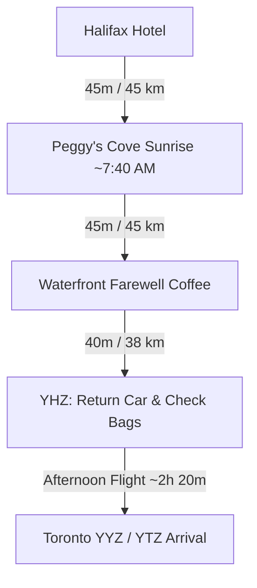

# 🌅 Day 5 (Wed, Oct 14): Peggy's Cove Sunrise, Halifax Farewell & Afternoon Return Flight

!!! success "Final Day (Return to Toronto) — Wednesday, October 14, 2026"
    **Base Camp**: Downtown Halifax (Hotel Night 2 of 2) → **Halifax Stanfield Airport (YHZ)**  
    **Total Driving Distance**: ~135 km (Peggy's Cove round-trip + YHZ transit)  
    **Primary Goal**: Catch the **sunrise at Peggy's Point Lighthouse**, keep Wednesday morning as unhurried **Peggy's Cove + Halifax area time**, then catch an **afternoon non-stop flight home to Toronto**.

!!! warning "✈️ Return Flight Target"
    **Book a Wed, Oct 14 YHZ → YYZ/YTZ departure of ~2:30 PM or later** (non-stop ~2h 20m; lands Toronto ~4:30–6:00 PM ET). Timeline below reaches YHZ by ~12:30 PM. The later you book, the more Halifax-area time you keep — a **3:30 PM+ flight** unlocks an optional Citadel perimeter/noon-gun stop at 11 AM. ⚠️ The Maritime Museum is **already done (Fri evening)** — no indoor stops needed today. Grohmann Knives from Pictou (if purchased Tue) **must ride in checked baggage**.

---

## 🗺️ Route Map & Overview

Your last morning belongs to the coast: an early run down the winding Lighthouse Route (Route 333) to watch the sun clear the Atlantic over the granite boulders of Peggy's Cove, then a relaxed farewell loop through Halifax before the airport.

> **Day-5 scope**: ✅ Peggy's Cove sunrise · ✅ Waterfront farewell · ✅ Afternoon flight home. ❌ Maritime Museum (done Friday) · ❌ Alexander Keith's tour (cut) · ❌ Citadel interior (perimeter/noon gun only, and only if your flight is 3:30 PM+).

???+ info "🗺️ Turn-by-Turn Google Maps Navigation Route"
    **Direct Navigation Link**: [**👉 Open Day 5 Route in Google Maps**](https://www.google.com/maps/dir/Downtown+Halifax%2C+Halifax%2C+NS/Peggy%27s+Point+Lighthouse%2C+Peggy%27s+Point+Road%2C+Peggy%27s+Cove%2C+NS/Queen%27s+Marque%2C+Lower+Water+Street%2C+Halifax%2C+NS/Halifax+Stanfield+International+Airport+%28YHZ%29%2C+Enfield%2C+NS){:target="_blank"} (~135 km, ~2h total drive)  
    *Click to launch live GPS navigation: Halifax → Peggy's Cove (sunrise) → waterfront farewell → Halifax Stanfield Airport (YHZ).*

### 📍 Route Stops Breakdown

| Stop | Location / Waypoint | Segment Dist & Time | Route Highway | Key Highlights & Actions |
|:---:|:---|:---:|:---|:---|
| **1** | **Downtown Halifax Hotel** | — | NS-333 W | Pre-dawn departure on the Lighthouse Route |
| **2** | **Peggy's Point Lighthouse** | 45 km (45 mins) | Route 333 (Prospect Rd) | 🌅 **Sunrise ~7:40 AM** over the granite boulders — beat every tour bus |
| **3** | **Halifax Waterfront Farewell** | 45 km (45 mins) | Route 333 to Downtown | Coffee + final boardwalk pass by Queen's Marque (skip if flight < 3 PM) |
| **4** | **Halifax Stanfield Airport (YHZ)** | 38 km (40 mins) | NS-102 N | Refuel, return rental car, check bags (knives in checked luggage!), security |
| **5** | **Toronto YYZ / YTZ** | Flight ~2h 20m | — | Afternoon non-stop home |

---

## ⏱️ Detailed Timeline & Activity Breakdown

### 06:45 AM – 10:00 AM: Peggy's Cove Sunrise & Granite Coastline
*Sunrise in mid-October is ~7:40 AM — you'll have the lighthouse to yourselves before the tour buses roll in.*

- **06:45 AM – 07:30 AM**: Depart downtown Halifax via NS-333 W (Prospect Road) in the pre-dawn light (45 km). Pack the car fully tonight — you go straight to the airport after this.
- **07:30 AM – 10:00 AM**: **Peggy's Point Lighthouse & Ancient Granite Formations**
  - **Location**: 72 Peggy's Point Rd, Peggy's Cove (44.4930° N, 63.9181° W).
  - **Exertion vs Lounging**: 1.5 km walking on granite slabs and accessible viewing deck (45 mins) + 1h 45m sunrise photography, the working dory fishing cove, and the William E. deGarthe Fishermen's Monument.
  - **Safety Warning**: ⚠️ **Stay off the black, wet rocks!** Rogue waves are frequent and dangerous. Always remain on the dry white granite boulders or the accessible viewing deck.
  - **Breakfast**: Sou'Wester Restaurant opens at the lighthouse for coffee and their famous gingerbread with lemon sauce.
  - **Direct Guide**: [Peggy's Cove Nova Scotia Tourism](https://www.novascotia.com/see-do/attractions/peggys-point-lighthouse/1468)

### 10:00 AM – 11:30 AM: Return to Halifax & Waterfront Farewell
- **10:00 AM – 10:45 AM**: Drive back to downtown Halifax via Route 333.
- **10:45 AM – 11:30 AM**: **Farewell boardwalk pass** — a last coffee/lobster-roll stop at the waterfront and a final look at the harbour.
  - *Optional (only if your flight is 3:30 PM or later):* quick **Citadel Hill perimeter + 12:00 PM noon gun** instead — free ramparts, interior exhibits cut.

### 11:45 AM – 01:15 PM: Transit to Halifax Stanfield Airport (YHZ)
- **11:45 AM – 12:30 PM**: Drive 38 km via NS-102 N to **Halifax Stanfield International Airport (YHZ)**.
- **12:30 PM – 01:15 PM**: Refuel the rental car, return keys at the airport rental garage, check bags (**Grohmann Knives in checked bags — never carry-on**), and clear security.

### 02:30 PM – 06:00 PM: Afternoon Non-Stop Flight Home to Toronto
- Board your afternoon non-stop YHZ → YYZ / YTZ (target departure **~2:30 PM or later**; ~2h 20m flight). Arrive Toronto mid/late afternoon Eastern Time (Atlantic is +1 hr ahead) — home in time for dinner.

---

## 🍽️ Dining & Restaurant Options (Morning Farewell Focus)

1. **Sou'Wester Restaurant & Gift Shop** *(Peggy's Cove - Sunrise Breakfast)*  
   - **Drive / Walk**: Directly beside Peggy's Point Lighthouse  
   - **Food Type**: Breakfast, classic maritime seafood & famous gingerbread  
   - **Price**: $$–$$$ ($12–$40 CAD)  
   - **Google Maps**: [The SouWester Restaurant Peggys Cove](https://maps.google.com/?q=Sou+Wester+Restaurant+Peggys+Cove)  
   - **Why Recommended**: Unbeatable panoramic windows looking straight at the lighthouse; warm gingerbread with hot lemon sauce while the sun comes up.

2. **Cable Wharf Kitchen / Murphy's on the Water** *(Halifax Boardwalk)*  
   - **Drive / Walk**: Directly on the Cable Wharf  
   - **Food Type**: Lobster rolls, chowder & harbour coffee  
   - **Price**: $$ ($14–$30 CAD)  
   - **Google Maps**: [Cable Wharf Kitchen Halifax](https://maps.google.com/?q=Cable+Wharf+Kitchen+Halifax)  
   - **Why Recommended**: Fast, open-air farewell lobster roll over the water before the airport run — you control the clock.

3. **Two If By Sea Café** *(Dartmouth, 2-min ferry detour)*  
   - **Drive / Walk**: 12-min Halifax→Dartmouth ferry from the boardwalk  
   - **Food Type**: Award-winning croissants & specialty coffee  
   - **Price**: $ ($4–$14 CAD)  
   - **Google Maps**: [Two If By Sea Cafe Dartmouth](https://maps.google.com/?q=Two+If+By+Sea+Cafe+Dartmouth)  
   - **Why Recommended**: Routinely ranked Canada's best croissant — a scenic ferry farewell if you have a 3:30 PM+ flight.

4. **Black Sheep Restaurant** *(Downtown - Dresden Row)*  
   - **Drive / Walk**: 10-min walk from Citadel Hill  
   - **Food Type**: Creative brunch and elevated modern comfort food  
   - **Price**: $$–$$$ ($18–$32 CAD)  
   - **Google Maps**: [Black Sheep Halifax](https://maps.google.com/?q=Black+Sheep+Halifax)  
   - **Why Recommended**: Pork belly eggs benedict or duck confit poutine — a hearty send-off if you're doing the Citadel noon-gun option.

5. **Millstone Public House** *(Bedford - Airport transit)*  
   - **Drive / Walk**: 15 min from YHZ Airport  
   - **Food Type**: Pre-flight pub meal & local seafood  
   - **Price**: $$ ($18–$28 CAD)  
   - **Google Maps**: [Millstone Public House Bedford](https://maps.google.com/?q=Millstone+Public+House+Bedford+NS)  
   - **Why Recommended**: Easy pub dining just off Highway 102 on the final drive to the airport — a fallback if the morning ran long.

6. **Khyber Grill / Tony's Donair & Pizza** *(Robie St / Downtown)*  
   - **Drive / Walk**: 5-min drive from waterfront  
   - **Food Type**: Traditional Halifax Donair & garlic fingers  
   - **Price**: $ ($10–$16 CAD)  
   - **Google Maps**: [Tonys Donair Halifax](https://maps.google.com/?q=Tonys+Donair+Halifax)  
   - **Why Recommended**: Grab a final authentic Halifax donair to-go for the flight.

---

## 🎒 Gear & Day Preparation
- **Camera / Polarizer Filter**: Sunrise light reflecting on granite and surf is the photographic payoff of the whole trip.
- **Windproof Jacket**: Coastal spray and autumn harbour breezes feel chilly pre-dawn (near 8°C).
- **Checked Bag Allocation (Mandatory)**: Return flight must include at least 1 checked bag — Grohmann Knives and any wine are prohibited in carry-on.
- **Pack Tonight (Tue)**: Load all luggage into the car the evening before so the 6:45 AM departure runs on schedule; keep ID and boarding passes accessible.
- **Flight Verification**: Confirm your exact afternoon departure time when booking — earlier flights mean skipping the waterfront/Citadel stops.
