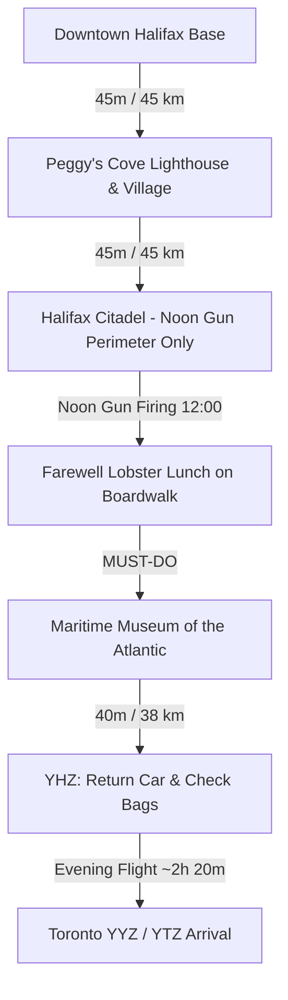

# 🌊 Day 5: Peggy's Cove, Halifax Farewell & Return Flight to Toronto

!!! success "Final Day (Return to Toronto) — Wednesday, October 14, 2026"
    **Base Camp**: Downtown Halifax → **Halifax Stanfield Airport (YHZ)**  
    **Total Driving Distance**: ~135 km (approx. 2 hours total drive incl. YHZ transit)  
    **Primary Goal**: Witness morning ocean swells at **Peggy's Point Lighthouse**, catch the historic **Citadel Noon Gun** (perimeter only), tour the **Maritime Museum of the Atlantic** (Titanic & Halifax Explosion galleries — *must-do*), enjoy a farewell lobster lunch, and catch an **evening non-stop flight home to Toronto**.

!!! warning "✈️ Return Flight Booking Target"
    **Book a Wed, Oct 14 evening departure of 7:30 PM or later** from YHZ to YYZ/YTZ (non-stop, ~2h 20m). Air Canada YYZ has the most late-evening frequency; Porter's last YTZ hop is often earlier. Timeline below has you at the airport by ~5:00 PM — do not book anything before ~6:45 PM departure. Grohmann Knives bought in Pictou **must ride in checked baggage**.

---

## 🗺️ Route Map & Overview

Today delivers the definitive highlights of coastal and urban Nova Scotia before your evening flight. You journey along the winding Lighthouse Route (Route 333) to the iconic granite coast of Peggy's Cove, return for the Citadel noon gun and a farewell waterfront lunch, tour the **Maritime Museum of the Atlantic**, then transit to YHZ for the flight home.

> **Cuts locked in for this return day**: ❌ Alexander Keith's 1820 Brewery Tour (removed) · ❌ Citadel paid interior exhibits (free perimeter + noon gun only) · ❌ Evening multi-course farewell feast (replaced by a 12:45 PM farewell lobster lunch). **Must-do kept**: ✅ Maritime Museum of the Atlantic.

???+ info "🗺️ Turn-by-Turn Google Maps Navigation Route"
    **Direct Navigation Link**: [**👉 Open Day 5 Route in Google Maps**](https://www.google.com/maps/dir/Downtown+Halifax%2C+Halifax%2C+NS/Peggy%27s+Point+Lighthouse%2C+Peggy%27s+Point+Road%2C+Peggy%27s+Cove%2C+NS/Halifax+Citadel+National+Historic+Site%2C+Halifax%2C+NS/Maritime+Museum+of+the+Atlantic%2C+Lower+Water+Street%2C+Halifax%2C+NS/Halifax+Stanfield+International+Airport+%28YHZ%29%2C+Enfield%2C+NS){:target="_blank"} (~135 km, ~2h total drive)  
    *Click to launch live GPS turn-by-turn navigation from Halifax to Peggy's Cove, returning through Citadel Hill and the Maritime Museum, and finishing at Halifax Stanfield Airport (YHZ) for your evening flight.*

### 📍 Route Stops Breakdown

| Stop | Location / Waypoint | Segment Dist & Time | Route Highway | Key Highlights & Actions |
|:---:|:---|:---:|:---|:---|
| **1** | **Downtown Halifax Base** | — | NS-333 W | Early morning departure on the Lighthouse Route past coastal coves |
| **2** | **Peggy's Point Lighthouse** | 45 km (45 mins) | Route 333 (Prospect Rd) | Beat tour buses; iconic granite boulders, dory fishing cove (⚠️ stay off black rocks!) |
| **3** | **Halifax Citadel Historic Site** | 45 km (45 mins) | Route 333 to Sackville St | 12:00 PM historic Noon Gun firing by 78th Highlanders — **free perimeter only, interior exhibits cut** |
| **4** | **Farewell Lunch on the Boardwalk** | 1 km (5 mins) | Lower Water St | Quick lobster roll / chowder farewell meal (replaces evening feast) |
| **5** | **Maritime Museum of the Atlantic** | 0.5 km (2 mins) | Lower Water St | ✅ **MUST-DO**: world's largest Titanic wooden-artifact collection & 1917 Halifax Explosion gallery |
| **6** | **Halifax Stanfield Airport (YHZ)** | 38 km (40 mins) | NS-102 N | Refuel, return rental car, check bags (knives in checked luggage!), security & evening flight home |

---

## ⏱️ Detailed Timeline & Activity Breakdown

### 07:30 AM – 10:15 AM: Morning at Peggy's Cove Lighthouse & Village
*Beat the tour buses to Nova Scotia's most photographed landmark.*

- **07:30 AM – 08:15 AM**: Depart downtown Halifax via NS-333 W (Prospect Road) winding past rugged coastal coves and granite barrens to **Peggy's Cove** (45 km). Pack the car fully tonight — you go straight to the airport after the museum.
- **08:15 AM – 10:15 AM**: **Peggy's Point Lighthouse & Ancient Granite Formations**
  - **Location**: 72 Peggy's Point Rd, Peggy's Cove (44.4930° N, 63.9181° W).
  - **Exertion vs Lounging**: 1.5 km walking on granite slabs and accessible viewing deck (45 mins) + 45 mins photography and walking through the working dory fishing cove and William E. deGarthe Fishermen's Monument.
  - **Safety Warning**: ⚠️ **Stay off the black, wet rocks!** Rogue waves are frequent and dangerous. Always remain on the dry white granite boulders or new accessible viewing deck.
  - **Direct Guide**: [Peggy's Cove Nova Scotia Tourism](https://www.novascotia.com/see-do/attractions/peggys-point-lighthouse/1468)
- **10:15 AM – 11:00 AM**: Depart Peggy's Cove and drive back to Halifax via Route 333.

---

### 11:00 AM – 12:45 PM: Halifax Citadel — Perimeter Ramparts & The Noon Gun (Free)
*Catch the iconic cannon blast, skip the paid interior exhibits to protect your flight buffer.*

- **11:00 AM – 12:45 PM**: **Citadel Hill Perimeter Walk + Noon Gun**
  - **Location**: 5425 Sackville St, Halifax (44.6468° N, 63.5813° W).
  - **Exertion vs Lounging**: 1.0 km easy perimeter ramparts walking (40 mins) + 20 mins assembled for the artillery firing.
  - **The Noon Gun Ritual**: Gather at the fortress parade square by **11:58 AM** to watch the 78th Highlanders (dressed in Victorian kilts) fire the historic 24-pounder smoothbore cannon at exactly 12:00 PM — a daily tradition dating back to 1857. Free perimeter access; no admission needed.
  - **Direct Guide**: [Parks Canada Halifax Citadel](https://parks.canada.ca/lhn-nhs/ns/halifax)

---

### 12:45 PM – 02:00 PM: Farewell Lobster Lunch on the Halifax Waterfront
*The multi-course evening farewell feast was cut to protect the flight — do the classic farewell at lunch instead.*

- **12:45 PM – 02:00 PM**: Walk down Citadel Hill to the waterfront boardwalk for a farewell Atlantic **lobster roll + chowder lunch** (Cable Wharf, Shuck, or Murphy's — see dining list). Toast the trip with a local craft cider or Tidal Bay wine by the harbour.

---

### 02:15 PM – 03:45 PM: Maritime Museum of the Atlantic (✅ MUST-DO)
*Nova Scotia's Titanic story — the one Halifax indoor attraction you refused to cut.*

- **02:15 PM – 03:45 PM**: **Maritime Museum of the Atlantic**
  - **Location**: 1675 Lower Water St, Halifax (44.6493° N, 63.5716° W).
  - **Exertion vs Lounging**: 1 hour 15 min indoor gallery walk (moderate) + 15 mins gift shop.
  - **Highlights**: World's largest permanent collection of wooden artifacts recovered from the **RMS Titanic** disaster (which brought victims to Halifax in 1912), plus the devastating 1917 **Halifax Explosion** exhibit and the CSS Acadia steamship.
  - **Logistics**: Admission ~$11/adult (Nova Scotia provincial museum — **not** covered by the Parks Canada Discovery Pass). Open 9:30 AM – 5:30 PM daily in October. Keep your receipt; if time runs short, the Titanic gallery is the priority.
  - **Direct Guide**: [Maritime Museum of the Atlantic Official Site](https://maritimemuseum.novascotia.ca/)
- **03:45 PM – 04:00 PM**: Load the rental car (bags already packed) for the airport run.

---

### 04:00 PM – 06:00 PM: Transit to Halifax Stanfield Airport (YHZ)
- **04:00 PM – 04:50 PM**: Drive 38 km via NS-102 N directly to **Halifax Stanfield International Airport (YHZ)**.
- **04:50 PM – 05:30 PM**: Refuel the rental car and return keys at the airport rental garage.
- **05:30 PM – 06:00 PM**: Check baggage (**Grohmann Knives from Pictou MUST be in checked bags** — never carry-on), pass security, and settle at the departure gate with one final craft pint.

---

### 07:00 PM – 10:30 PM: Evening Non-Stop Flight Home to Toronto
- **07:30 PM – 09:00 PM**: Board your evening non-stop flight YHZ → YYZ / YTZ (target departure **7:30 PM or later**; ~2h 20m flight). Arrive Toronto in the evening Eastern Time (Atlantic is +1 hr ahead).

---

## 🍽️ Dining & Restaurant Options (Farewell Lunch Focus)

1. **Murphy's on the Water / Cable Wharf Kitchen** *(Halifax Boardwalk)*  
   - **Drive / Walk**: Directly on the Cable Wharf, 5-min from Maritime Museum  
   - **Food Type**: Classic lobster rolls, chowder & patio drinks  
   - **Price**: $$–$$$ ($22–$45 CAD)  
   - **Google Maps**: [Cable Wharf Kitchen Halifax](https://maps.google.com/?q=Cable+Wharf+Kitchen+Halifax)  
   - **Why Recommended**: Open-air seaside patio extending right over the water; the perfect fast farewell lobster roll before the museum. Fast service — you control the clock.

2. **Shuck Seafood Bar & The Press Gang** *(Downtown Halifax)*  
   - **Drive / Walk**: 4-min walk from Waterfront  
   - **Food Type**: Raw oyster bar, fresh ocean catches, historic 1759 stone ambiance  
   - **Price**: $$$ ($28–$55 CAD)  
   - **Google Maps**: [The Press Gang Halifax](https://maps.google.com/?q=The+Press+Gang+Halifax)  
   - **Why Recommended**: One of the oldest surviving stone structures in Halifax; exceptional oyster shucking from around Prince Edward Island, Cape Breton, and Nova Scotia's South Shore.

3. **Sou'Wester Restaurant & Gift Shop** *(Peggy's Cove - Morning)*  
   - **Drive / Walk**: Directly beside Peggy's Point Lighthouse  
   - **Food Type**: Classic maritime breakfast, seafood & famous gingerbread  
   - **Price**: $$–$$$ ($18–$40 CAD)  
   - **Google Maps**: [The SouWester Restaurant Peggys Cove](https://maps.google.com/?q=Sou+Wester+Restaurant+Peggys+Cove)  
   - **Why Recommended**: Unbeatable panoramic windows looking straight at the lighthouse; grab warm traditional gingerbread with hot lemon sauce before driving back to the city.

4. **Black Sheep Restaurant** *(Downtown - Dresden Row)*  
   - **Drive / Walk**: 10-min walk from Citadel Hill  
   - **Food Type**: Creative brunch and elevated modern comfort food  
   - **Price**: $$–$$$ ($18–$32 CAD)  
   - **Google Maps**: [Black Sheep Halifax](https://maps.google.com/?q=Black+Sheep+Halifax)  
   - **Why Recommended**: Celebrated for creative pork belly eggs benedict, duck confit poutine, and craft cocktail mixology — a robust pre-noon-gun brunch option if you slept in.

5. **Khyber Grill / Tony's Donair & Pizza** *(Robie St / Downtown)*  
   - **Drive / Walk**: 5-min drive from waterfront  
   - **Food Type**: Traditional Halifax Donair, Garlic Fingers & Poutine  
   - **Price**: $ ($10–$16 CAD)  
   - **Google Maps**: [Tonys Donair Halifax](https://maps.google.com/?q=Tonys+Donair+Halifax)  
   - **Why Recommended**: Grab a final authentic Halifax donair to-go for the airport — the city's official food, invented here in 1973.

6. **Maritime Ale House / Millstone Public House** *(Bedford - Airport transit)*  
   - **Drive / Walk**: 15 min from YHZ Airport  
   - **Food Type**: Pre-flight pub meal & local seafood  
   - **Price**: $$ ($18–$28 CAD)  
   - **Google Maps**: [Millstone Public House Bedford](https://maps.google.com/?q=Millstone+Public+House+Bedford+NS)  
   - **Why Recommended**: Easy and stress-free pub dining just off Highway 102 on the final drive to the airport — a fallback if the boardwalk lunch ran long.

---

## 🎒 Gear & Day Preparation
- **Camera / Polarizer Filter**: Peggy's Cove morning light reflecting on the granite and surf provides dramatic photographic opportunities.
- **Windproof Jacket**: Coastal spray and autumn harbor breezes can feel chilly even on bright sunny afternoons.
- **Checked Bag Allocation (Mandatory)**: Your return flight MUST include at least one checked bag — Grohmann Knives and any wine purchased are prohibited in carry-on.
- **Pack Tonight**: Load all luggage into the car the evening of Day 4 so the morning runs on schedule; keep passports/ID and boarding passes accessible.
- **Museum Hours Check**: Confirm Maritime Museum of the Atlantic hours/admission on the morning of Day 5 (9:30 AM – 5:30 PM in October).
