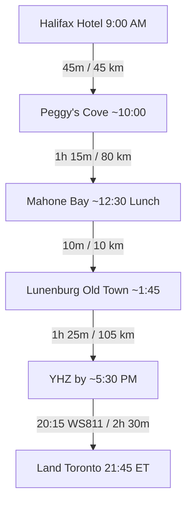

# 🌅 Day 5 (Wed, Oct 14): Peggy's Cove, Mahone Bay & Lunenburg Loop — Evening Flight (WS811)

!!! success "Final Day (Return to Toronto) — Wednesday, October 14, 2026"
    **Route**: Downtown Halifax → Peggy's Cove → Mahone Bay → Lunenburg → **Halifax Stanfield Airport (YHZ)**  
    **Total Driving Distance**: ~240 km (approx. 3h 20m combined drive, one-way loop)  
    **Primary Goal**: A relaxed final day over three coastal icons — **sunrise-independent Peggy's Cove**, the three churches of **Mahone Bay**, and the UNESCO Old Town of **Lunenburg** — then a straight run to YHZ for the evening flight. **No early start required: WS811 departs 20:15, so the day starts ~9:00 AM.**

!!! success "✈️ Return Flight BOOKED — WestJet WS811"
    **Wed, Oct 14 · 20:15 Halifax (YHZ) → 21:45 Toronto-Pearson (YYZ)** · Non-stop 2h 30m · Boeing 737 MAX 8 · Reservation **OEFTZF** · UltraBasic fare, $226.76 paid. *(Receipt: `receipts/WestJet.pdf`)*.  
    ⚠️ **UltraBasic = 1 personal item only — NO carry-on and NO checked bag included.** Add a **checked bag (mandatory for the Grohmann knives + wine) via WestJet Manage Trips** well before departure. Land 21:45 ET — plan for a late night home.

---

## 🗺️ Route Map & Overview

One seamless coastal loop: drive west to **Peggy's Cove** at your leisure, swing down Hwy 103 to the South Shore's postcard **Mahone Bay**, hop over to the UNESCO **Lunenburg Old Town** for lunch and a waterfront stroll, then head straight north to YHZ — no returning to downtown Halifax.

> **Day-5 scope**: ✅ Peggy's Cove morning · ✅ Mahone Bay · ✅ **Lunenburg Old Town (UNESCO)** · ✅ straight-to-airport finish. ❌ Citadel noon gun (sacrificed — you're on the road at noon; restore only by cutting Mahone Bay/Lunenburg) · ❌ Maritime Museum (done Friday evening) · ❌ Alexander Keith's tour (cut).

???+ info "🗺️ Turn-by-Turn Google Maps Navigation Route"
    **Direct Navigation Link**: [**👉 Open Day 5 Route in Google Maps**](https://www.google.com/maps/dir/Downtown+Halifax%2C+Halifax%2C+NS/Peggy%27s+Point+Lighthouse%2C+Peggy%27s+Point+Road%2C+Peggy%27s+Cove%2C+NS/Mahone+Bay%2C+NS/Old+Town+Lunenburg%2C+Montague+Street%2C+Lunenburg%2C+NS/Halifax+Stanfield+International+Airport+%28YHZ%29%2C+Enfield%2C+NS){:target="_blank"} (~240 km, ~3h 20m total drive)  
    *Click to launch live GPS navigation: Halifax → Peggy's Cove → Mahone Bay → Lunenburg Old Town → Halifax Stanfield Airport (YHZ).*

### 📍 Route Stops Breakdown

| Stop | Location / Waypoint | Segment Dist & Time | Route Highway | Key Highlights & Actions |
|:---:|:---|:---:|:---|:---|
| **1** | **Downtown Halifax Hotel** | — | NS-333 W | Relaxed morning departure (no sunrise needed — flight is 20:15) |
| **2** | **Peggy's Point Lighthouse** | 45 km (45 mins) | Route 333 | Iconic granite headland, lighthouse & cove; coffee at Sou'Wester |
| **3** | **Mahone Bay** | 80 km (1h 15m) | 333 → Hwy 103 S → Route 3 | Three churches on the water, artisan shops, pub lunch option |
| **4** | **Lunenburg Old Town (UNESCO)** | 10 km (10 mins) | Route 3 | Stroll the world-heritage waterfront, Bluenose story, seafood lunch |
| **5** | **Halifax Stanfield Airport (YHZ)** | 105 km (1h 25m) | Route 3 → Hwy 103 N → NS-102 N | Refuel, return rental car, check bags, security → WS811 20:15 |

---

## ⏱️ Detailed Timeline & Activity Breakdown

### 09:00 AM – 11:30 AM: Peggy's Cove at a Civilized Hour
- **09:00 AM – 09:45 AM**: Depart downtown Halifax on Route 333 (Prospect Road) — no pre-dawn alarm needed.
- **09:45 AM – 11:15 AM**: **Peggy's Point Lighthouse & Ancient Granite Formations**
  - **Location**: 72 Peggy's Point Rd, Peggy's Cove (44.4930° N, 63.9181° W). **Open 24h — no closing time to beat.**
  - **Exertion vs Lounging**: 1.5 km walking on granite slabs + accessible viewing deck (45 mins) + 1h photographing the lighthouse, working dory cove, and the William E. deGarthe Fishermen's Monument.
  - **Safety Warning**: ⚠️ **Stay off the black, wet rocks!** Rogue waves are frequent and dangerous. Stay on the dry white granite or the accessible viewing deck.
  - **Breakfast/Coffee**: **Sou'Wester Restaurant** opens at the lighthouse — famous gingerbread with warm lemon sauce.
  - **Direct Guide**: [Peggy's Cove Nova Scotia Tourism](https://www.novascotia.com/see-do/attractions/peggys-point-lighthouse/1468)

### 11:15 AM – 01:45 PM: Mahone Bay — Three Churches & Harbour Lunch
- **11:15 AM – 12:30 PM**: Drive south: return along the 333 through St. Margaret's Bay, join **Hwy 103 S**, and exit to **Mahone Bay** on Route 3 (~80 km, 1h 15m).
- **12:30 PM – 01:45 PM**: **Mahone Bay Harbour** — the famous **Three Churches** waterfront lineup, artisan shops (Amos Pewter, pottery galleries), and a relaxed harbour lunch or bakery stop.
  - **Direct Guides**: [Mahone Bay Tourism](https://www.mahonebay.com/) | [Amos Pewter](https://www.amospewter.com/)

### 01:45 PM – 04:00 PM: Lunenburg Old Town — UNESCO World Heritage
- **01:45 PM – 04:00 PM**: **Lunenburg Old Town** (10 min hop from Mahone Bay) — one of only two UNESCO World Heritage towns in Canada.
  - Walk **King Street / Old Town** with its candy-coloured houses and the waterfront boardwalk along **Montague Street**.
  - **Lunenburg Fisheries Museum of the Atlantic** — the dory/boatbuilding story and the **Bluenose II** schooner heritage (check whether Bluenose II is in port for the season).
  - **Seafood lunch**: enjoy a proper farewell meal on the water (Fish Shack / Saviard / Salt Shaker Deli — see dining below).
  - **Direct Guides**: [Lunenburg Tourism](https://www.explorelunenburg.ca/) | [Fisheries Museum](https://fisheriesmuseum.novascotia.ca/)

### 04:00 PM – 05:30 PM: Straight-Line Run to YHZ
- **04:00 PM – 05:30 PM**: Drive north via Route 3 → Hwy 103 N → **NS-102 N** to **Halifax Stanfield Airport** (~105 km, ~1h 25m). *Hard rule: leave Lunenburg by 4:00 PM to keep the flight buffer — you arrive YHZ ~5:30 PM, a full 2h 45m before departure.*

### 05:30 PM – 08:15 PM: Renturn Car, Security & Evening Flight
- **05:30 PM – 06:15 PM**: Refuel (Hwy 102 gas, not the airport station), return the National rental at the YHZ garage, **check the pre-added/shipped bag** (Grohmann knives — never carry-on; UltraBasic has no carry-on at all).
- **06:15 PM – 07:45 PM**: Clear security; last coffee; gate.
- **08:15 PM – 09:45 PM**: **WestJet WS811** non-stop to Toronto-Pearson (Boeing 737 MAX 8, 2h 30m). Land **21:45 ET** — late night home, plan ahead.

---

## 🍽️ Dining & Restaurant Options (South Shore Farewell Focus)

1. **The Fish Shack** *(Lunenburg Waterfront)*  
   - **Drive / Walk**: On the Lunenburg waterfront boardwalk  
   - **Food Type**: Fresh East Coast seafood, fish & chips, lobster  
   - **Price**: $$–$$$ ($16–$35 CAD)  
   - **Google Maps**: [The Fish Shack Lunenburg](https://maps.google.com/?q=The+Fish+Shack+Lunenburg+NS)  
   - **Why Recommended**: Quintessential final seafood meal on the water in the UNESCO town — halibut sandwich, fried clams, lobster roll; casual lines but worth it.

2. **Saviard** *(Lunenburg - Wood St)*  
   - **Drive / Walk**: 3-min walk from the waterfront  
   - **Food Type**: Elevated modern seafood & seasonal plates  
   - **Price**: $$–$$$ ($20–$40 CAD)  
   - **Google Maps**: [Saviard Lunenburg](https://maps.google.com/?q=Saviard+Lunenburg+NS)  
   - **Why Recommended**: Consistently the best-reviewed kitchen in Lunenburg — refined local seafood (digby scallops, fish prepped daily) if you want a more proper farewell.

3. **The Salt Shaker Deli** *(Lunenburg - Montague St)*  
   - **Drive / Walk**: On the main Old Town street  
   - **Food Type**: Gourmet sandwiches, chowder, fresh-baked bread  
   - **Price**: $–$$ ($10–$20 CAD)  
   - **Google Maps**: [The Salt Shaker Deli Lunenburg](https://maps.google.com/?q=The+Salt+Shaker+Deli+Lunenburg)  
   - **Why Recommended**: Famous warm-chicken-curry roti and huge sandwiches — the fast, cheap-and-legendary option if you want max Old Town walking time.

4. **The Mug & Anchor** *(Mahone Bay - Edgewater St)*  
   - **Drive / Walk**: Waterfront, Mahone Bay  
   - **Food Type**: Pub fare, chowder & pints on the bay  
   - **Price**: $$ ($14–$28 CAD)  
   - **Google Maps**: [Mug and Anchor Mahone Bay](https://maps.google.com/?q=Mug+and+Anchor+Mahone+Bay+NS)  
   - **Why Recommended**: Easy harbour-side lunch with a view of the three churches — chowder, fish tacos, and local brews.

5. **Sou'Wester Restaurant & Gift Shop** *(Peggy's Cove - breakfast/coffee)*  
   - **Drive / Walk**: Directly beside Peggy's Point Lighthouse  
   - **Food Type**: Breakfast, shellfish & famous gingerbread  
   - **Price**: $$–$$$ ($12–$40 CAD)  
   - **Google Maps**: [The SouWester Restaurant Peggys Cove](https://maps.google.com/?q=Sou+Wester+Restaurant+Peggys+Cove)  
   - **Why Recommended**: Warm gingerbread with lemon sauce while you watch the surf — the morning kickstart.

6. **Millstone Public House** *(Bedford - airport transit fallback)*  
   - **Drive / Walk**: 15 min from YHZ Airport  
   - **Food Type**: Pre-flight pub meal & local seafood  
   - **Price**: $$ ($18–$28 CAD)  
   - **Google Maps**: [Millstone Public House Bedford](https://maps.google.com/?q=Millstone+Public+House+Bedford+NS)  
   - **Why Recommended**: Freedom-to-roam safety net: if you want to leave Lunenburg later, this is the airport-adjacent stop instead.

---

## 🎒 Gear & Day Preparation
- **🚨 Action Item — Add a checked bag to WS811 NOW** (WestJet Manage Trips): UltraBasic includes **no carry-on and no checked bag** — the Grohmann Knives + wine are prohibited in carry-on.
- **Comfortable Walking Shoes**: Lunenburg Old Town is perfectly walkable but hilly cobble — shoes matter more than ever today.
- **Camera**: Lighthouse light at Peggy's, the three churches, and candy-coloured Lunenburg streets.
- **Car Packed All Day**: You check out in the morning and will not return to the hotel — load everything at checkout; only stop is YHZ.
- **Paper/Digital Rental Return Kit**: National rental confirmation (#2098647349) for the YHZ return desk + phone charging cable for offline maps on Hwy 103 (patchy in places).
- **Late Night Home**: Landing 21:45 ET means Toronto front door ~11:30 PM — line up transit/parking ahead.