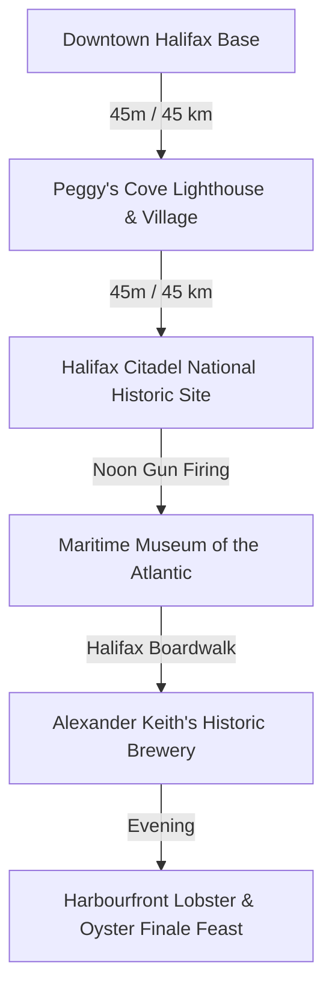

# 🌊 Day 5: Peggy's Cove Granite Coastline & Historic Halifax Waterfront

!!! success "Core Itinerary Day 5 (Grand Finale Day) — Wednesday, October 14, 2026"
    **Base Camp**: Downtown Halifax  
    **Total Driving Distance**: ~95 km (approx. 1.5 hours total drive time)  
    **Primary Goal**: Witness morning ocean swells at **Peggy’s Point Lighthouse**, stand atop **Citadel Hill** for the historic noon gun, walk the world’s longest harbor boardwalk, tour **Alexander Keith’s 1820 Brewery**, and celebrate with an Atlantic lobster feast.

---

## 🗺️ Route Map & Overview

Today delivers the definitive highlights of coastal and urban Nova Scotia. You journey along the winding Lighthouse Route (Route 333) to the iconic granite coast of Peggy's Cove, then return to explore the deep maritime history and culinary heartbeat of Halifax.

---

## ⏱️ Detailed Timeline & Activity Breakdown

### 07:30 AM – 10:45 AM: Morning at Peggy's Cove Lighthouse & Village
*Beat the tour buses to Nova Scotia’s most photographed landmark.*

- **07:30 AM – 08:15 AM**: Depart downtown Halifax via NS-333 W (Prospect Road) winding past rugged coastal coves and granite barrens to **Peggy's Cove** (45 km).
- **08:15 AM – 10:30 AM**: **Peggy's Point Lighthouse & Ancient Granite Formations**
  - **Location**: 72 Peggy's Point Rd, Peggy's Cove (44.4930° N, 63.9181° W).
  - **Exertion vs Lounging**: 1.5 km walking on granite slabs and accessible viewing deck (45 mins) + 45 mins photography and walking through the working dory fishing cove and William E. deGarthe Fishermen's Monument.
  - **Safety Warning**: ⚠️ **Stay off the black, wet rocks!** Rogue waves are frequent and dangerous. Always remain on the dry white granite boulders or new accessible viewing deck.
  - **Direct Guide**: [Peggy's Cove Nova Scotia Tourism](https://www.novascotia.com/see-do/attractions/peggys-point-lighthouse/1468)
- **10:30 AM – 11:15 AM**: Drive back to Halifax via Route 333.

---

### 11:30 AM – 01:15 PM: Halifax Citadel National Historic Site & Noon Gun
- **11:30 AM – 01:15 PM**: **Halifax Citadel Hill Exploration**
  - **Location**: 5425 Sackville St, Halifax (44.6468° N, 63.5813° W).
  - **Exertion vs Lounging**: 1.0 km uphill walking and ramparts exploration (45 mins) + 45 mins observing the museum and artillery firing.
  - **The Noon Gun Ritual**: Gather precisely at **11:58 AM** at the fortress parade square to watch the 78th Highlanders (dressed in Victorian kilts) fire the historic 24-pounder smoothbore cannon at exactly 12:00 PM—a daily tradition dating back to 1857.
  - **Direct Guide**: [Parks Canada Halifax Citadel](https://parks.canada.ca/lhn-nhs/ns/halifax)

---

### 01:30 PM – 03:30 PM: Halifax Waterfront Boardwalk & Maritime Museum
- **01:30 PM – 02:15 PM**: Casual boardwalk lunch (fresh seafood chowder or lobster roll on the wharf).
- **02:15 PM – 03:30 PM**: **Maritime Museum of the Atlantic**
  - **Location**: 1675 Lower Water St, Halifax.
  - **Exertion vs Lounging**: 1 hour indoor gallery walk (moderate) + 15 mins gift shop.
  - **Highlights**: World's largest permanent collection of wooden artifacts recovered from the **RMS Titanic** disaster (which brought victims to Halifax in 1912), plus the devastating 1917 **Halifax Explosion** exhibit.
  - **Direct Guide**: [Maritime Museum of the Atlantic Official Site](https://maritimemuseum.novascotia.ca/)

---

### 03:45 PM – 05:30 PM: Alexander Keith's Historic 1820 Brewery Tour
- **03:45 PM – 05:15 PM**: **The Original Alexander Keith's Brewery Experience**
  - **Location**: 1496 Lower Water St, Halifax (44.6433° N, 63.5728° W).
  - **Exertion vs Lounging**: 1-hour interactive theatrical tour through the original 1820 stone brewhouse led by animators in period attire + 30 mins sampling historic India Pale Ale, Red Amber Ale, and seasonal stouts in the subterranean Stag's Head Tavern with live folk songs.
  - **Direct Guide**: [Alexander Keith's Brewery Tours](https://www.keiths.ca/)

---

### 06:30 PM – 10:00 PM: Grand Finale Lobster & Seafood Celebration
- Savor your final evening in Nova Scotia with an authentic multi-course Atlantic lobster supper, oysters, Digby scallops, and local Nova Scotia Tidal Bay wine overlooking the illuminated harbor.

---

## 🍽️ Dining & Restaurant Options

1. **Drift** *(Queen’s Marque, Halifax Waterfront)*  
   - **Drive / Walk**: On the waterfront boardwalk  
   - **Food Type**: Modern Atlantic culinary showcase & oceanfront cocktail bar  
   - **Price**: $$$–$$$$ ($32–$65 CAD)  
   - **Google Maps**: [Drift Halifax](https://maps.google.com/?q=Drift+Halifax)  
   - **Why Recommended**: The flagship culinary destination of the Queen's Marque district; features Nova Scotia lobster with buttered hushpuppies, Yarmouth bluefin tuna, and roasted local chanterelles.

2. **Sou'Wester Restaurant & Gift Shop** *(Peggy's Cove - Morning / Lunch)*  
   - **Drive / Walk**: Directly beside Peggy's Point Lighthouse  
   - **Food Type**: Classic maritime seafood, lobster dinners & gingerbread  
   - **Price**: $$–$$$ ($18–$40 CAD)  
   - **Google Maps**: [The SouWester Restaurant Peggys Cove](https://maps.google.com/?q=Sou+Wester+Restaurant+Peggys+Cove)  
   - **Why Recommended**: Unbeatable panoramic windows looking straight at the lighthouse; famous for warm traditional gingerbread served with hot lemon sauce or ice cream.

3. **Shuck Seafood Bar & The Press Gang** *(Downtown Halifax)*  
   - **Drive / Walk**: 4-min walk from Waterfront  
   - **Food Type**: Raw oyster bar, fresh ocean catches, historic 1759 stone ambiance  
   - **Price**: $$$ ($28–$55 CAD)  
   - **Google Maps**: [The Press Gang Halifax](https://maps.google.com/?q=The+Press+Gang+Halifax)  
   - **Why Recommended**: One of the oldest surviving stone structures in Halifax; exceptional oyster shucking from all around Prince Edward Island, Cape Breton, and Nova Scotia’s South Shore.

4. **Khyber Grill / Tony's Donair & Pizza** *(Robie St / Downtown)*  
   - **Drive / Walk**: 5-min drive from waterfront  
   - **Food Type**: Traditional Halifax Donair, Garlic Fingers & Poutine  
   - **Price**: $ ($10–$16 CAD)  
   - **Google Maps**: [Tonys Donair Halifax](https://maps.google.com/?q=Tonys+Donair+Halifax)  
   - **Why Recommended**: Late-night institution for the ultimate authentic Nova Scotia donair craving.

5. **Murphy's on the Water / Cable Wharf Kitchen** *(Halifax Boardwalk)*  
   - **Drive / Walk**: Directly on the Cable Wharf  
   - **Food Type**: Classic lobster suppers, fish & chips, patio drinks  
   - **Price**: $$–$$$ ($22–$45 CAD)  
   - **Google Maps**: [Cable Wharf Kitchen Halifax](https://maps.google.com/?q=Cable+Wharf+Kitchen+Halifax)  
   - **Why Recommended**: Open-air seaside patio extending right over the water; excellent steamed lobster dinners with melted herb butter and sea salted corn.

6. **Black Sheep Restaurant** *(Downtown - Dresden Row)*  
   - **Drive / Walk**: 10-min walk from Citadel Hill  
   - **Food Type**: Creative brunch and elevated modern comfort food  
   - **Price**: $$–$$$ ($18–$32 CAD)  
   - **Google Maps**: [Black Sheep Halifax](https://maps.google.com/?q=Black+Sheep+Halifax)  
   - **Why Recommended**: Celebrated for creative pork belly eggs benedict, duck confit poutine, and craft cocktail mixology.

---

## 🎒 Gear & Day Preparation
- **Camera / Polarizer Filter**: Peggy’s Cove morning light reflecting on the granite and surf provides dramatic photographic opportunities.
- **Windproof Jacket**: Coastal spray and autumn harbor breezes can feel chilly even on bright sunny afternoons.
