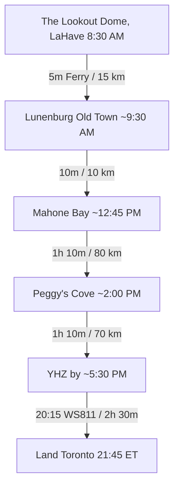

# 🌊 Day 5 (Wed, Oct 14): LaHave, Lunenburg, Mahone Bay & Peggy's Cove — Evening Flight (WS811)

!!! note "Day 5 — Wednesday, October 14, 2026 (Return to Toronto)"
    **Route**: The Lookout Dome (LaHave) → LaHave Ferry → Lunenburg UNESCO → Mahone Bay → Peggy's Cove → **Halifax Stanfield Airport (YHZ)**  
    **Total Driving Distance**: ~190 km (approx. 3 h 30 m total drive)  
    **Primary Goal**: Wake up on the South Shore at **The Lookout Dome in LaHave**, grab fresh sourdough and coffee at **LaHave Bakery**, ride the historic **LaHave Cable Ferry** across to **Old Town Lunenburg (UNESCO)**, explore the Three Churches of **Mahone Bay**, visit iconic **Peggy's Cove**, and head straight to YHZ for your evening flight (WS811 departs 20:15).

!!! success "✈️ Return Flight BOOKED — WestJet WS811"
    **Wed, Oct 14 · 20:15 Halifax (YHZ) → 21:45 Toronto-Pearson (YYZ)** · Non-stop 2h 30m · Boeing 737 MAX 8 · Reservation **OEFTZF** · UltraBasic fare, $226.76 paid. *(Receipt: `receipts/WestJet.pdf`)*.  
    ⚠️ **UltraBasic = 1 personal item only — NO carry-on and NO checked bag included.** Add a **checked bag (mandatory for the Grohmann knives + wine) via WestJet Manage Trips** well before departure. Land 21:45 ET — plan for a late night home.

---

## 🗺️ Route Map & Overview

A seamless coastal journey starting from LaHave along Nova Scotia's South Shore: ride the historic cable ferry, explore the colourful UNESCO Old Town of **Lunenburg**, admire the postcard Three Churches of **Mahone Bay**, walk the ancient granite headland at **Peggy's Point Lighthouse**, and head straight to YHZ airport for your evening flight home.

???+ info "🗺️ Turn-by-Turn Google Maps Navigation Route"
    **Direct Navigation Link**: [**🔗 Open Day 5 Route in Google Maps**](https://www.google.com/maps/dir/3839+Nova+Scotia+331,+LaHave,+NS/Old+Town+Lunenburg,+Montague+Street,+Lunenburg,+NS/Mahone+Bay,+NS/Peggy's+Point+Lighthouse,+Peggy's+Point+Road,+Peggy's+Cove,+NS/Halifax+Stanfield+International+Airport+(YHZ),+Enfield,+NS){:target="_blank"} (~190 km, ~3 h 30 m total drive)  
    *Click to launch live GPS navigation: The Lookout Dome (LaHave) → Lunenburg Old Town → Mahone Bay → Peggy's Point Lighthouse → Halifax Stanfield Airport (YHZ).*

### 📍 Route Stops Breakdown

| Stop | Location / Waypoint | Segment Dist & Time | Route Highway | Key Highlights & Actions |
|:---:|:---|:---:|:---|:---|
| **1** | **The Lookout Dome (LaHave)** | — | Hwy 331 | Morning departure, artisan breakfast at nearby LaHave Bakery |
| **2** | **LaHave Cable Ferry** | 2 km (5 mins) | Route 331 to Ferry | Historic 5-min cable ferry crossing across the river ($7 CAD) |
| **3** | **Lunenburg Old Town (UNESCO)** | 15 km (15 mins) | Route 332 N | Candy-coloured waterfront, Bluenose II berth, seafood lunch |
| **4** | **Mahone Bay** | 10 km (10 mins) | Route 3 | Famous Three Churches harbour view, Amos Pewter, artisan stroll |
| **5** | **Peggy's Point Lighthouse** | 80 km (1h 10m) | Hwy 103 N to Route 333 | Iconic granite headland & lighthouse; gingerbread at Sou'Wester |
| **6** | **Halifax Stanfield Airport (YHZ)** | 70 km (1 h 10 m) | Route 333 to NS-102 N | Refuel on Hwy 102, return rental car by 6:00 PM → WS811 20:15 |

---

## ⏱️ Detailed Timeline & Activity Breakdown

### 08:30 AM – 10:00 AM: Wake Up in the Dome, LaHave Bakery & Cable Ferry
- **08:30 AM – 09:30 AM**: Check out of **The Lookout Dome One** (check-out by 11:00 AM, but leaving ~9:00 AM maximizes your day). Drive 2 minutes down Hwy 331 to the legendary **LaHave Bakery** (3421 Hwy 331) for fresh-baked cheddar dill scones, sourdough, and espresso right over the water.
- **09:30 AM – 10:00 AM**: Board the historic **LaHave Cable Ferry** (runs every 15–30 min; $7.00 CAD cash). Enjoy the scenic 5-minute crossing across the mouth of the LaHave River to East LaHave, connecting directly to Route 332 North toward Lunenburg (~15 km, ~15 mins).

### 10:00 AM – 12:30 PM: Lunenburg Old Town — UNESCO World Heritage & Seafood Lunch
- **10:00 AM – 12:30 PM**: **Lunenburg Old Town** — one of only two UNESCO World Heritage towns in North America.
  - **Waterfront & Architecture**: Walk the steep grid of colourful 18th-century captain's homes along King Street, Pelham Street, and the bustling working waterfront on **Montague Street**.
  - **Maritime Heritage**: View the berth of Canada's sailing ambassador, the **Bluenose II** schooner, and visit the **Fisheries Museum of the Atlantic**.
  - **Farewell Seafood Lunch**: Enjoy an early lunch on the water: famous chowder and fish tacos at **The Fish Shack**, artisan roti and soup at **The Salt Shaker Deli**, or local fish and seafood at **The Grand Banker**.
  - **Direct Guides**: [Lunenburg Tourism](https://www.explorelunenburg.ca/) | [Fisheries Museum](https://fisheriesmuseum.novascotia.ca/)

### 12:45 PM – 02:00 PM: Mahone Bay — Three Churches & Artisan Stroll
- **12:45 PM – 01:00 PM**: Take the quick 10-minute scenic drive along Route 3 from Lunenburg to **Mahone Bay** (~10 km).
- **01:00 PM – 02:00 PM**: **Mahone Bay Harbour**:
  - Marvel at the world-famous view of the **Three Churches** (St. James Anglican, St. John's Evangelical Lutheran, and Trinity United) reflected in the calm waters of the harbour basin.
  - Stroll Edgewater Street to browse artisanal studios including **Amos Pewter** (handcrafted pewter jewelry and ornaments) and local pottery shops.
  - **Direct Guides**: [Mahone Bay Tourism](https://www.mahonebay.com/) | [Amos Pewter](https://www.amospewter.com/)

### 02:00 PM – 04:00 PM: Peggy's Point Lighthouse & Ancient Granite Formations
- **02:00 PM – 03:10 PM**: Drive north along Hwy 103 to Exit 5, then follow Route 333 (Prospect Road) winding around St. Margaret's Bay directly to **Peggy's Cove** (~80 km, ~1h 10m).
- **03:10 PM – 04:00 PM**: **Peggy's Point Lighthouse**:
  - **Location**: 72 Peggy's Point Rd, Peggy's Cove (44.4930° N, 63.9181° W).
  - **Effort & Timing**: Walk the smooth, pale white granite headland and the accessible wooden viewing platform to photograph the world-famous red-and-white beacon against the roaring Atlantic surf.
  - **Safety Warning**: ⚠️ **STAY OFF THE BLACK ROCKS!** Rogue Atlantic swells surge unpredictably over dark rock. Stay on high, dry white granite.
  - **Afternoon Treat**: Pop into the **Sou'Wester Restaurant** next to the lighthouse for their famous warm gingerbread drenched in lemon sauce and coffee.
  - **Direct Guide**: [Peggy's Cove Nova Scotia Tourism](https://www.novascotia.com/see-do/attractions/peggys-point-lighthouse/1468)

### 04:00 PM – 05:30 PM: Scenic Run to Halifax Stanfield Airport (YHZ)
- **04:00 PM – 05:30 PM**: Depart Peggy's Cove via Route 333 North connecting to Hwy 102 North straight to **Halifax Stanfield Airport (YHZ)** (~65 km, ~50 mins drive time).
  - *Hard Rule*: Leaving Peggy's Cove by 4:00 PM ensures you arrive at YHZ by ~5:15–5:30 PM, giving you a full 2 hours and 45 minutes before flight departure.

### 05:30 PM – 08:15 PM: Return Car, Security & Evening Flight
- **05:30 PM – 06:15 PM**: Refuel (Hwy 102 gas, not the airport station), return the National rental at the YHZ garage, **check the pre-added/shipped bag** (Grohmann knives — never carry-on; UltraBasic has no carry-on at all).
- **06:15 PM – 07:45 PM**: Clear security; last coffee; gate.
- **08:15 PM – 09:45 PM**: **WestJet WS811** non-stop to Toronto-Pearson (Boeing 737 MAX 8, 2h 30m). Land **21:45 ET** — late night home, plan ahead.

---

## 🍽️ Dining & Restaurant Options (South Shore Farewell Focus)

1. **The Fish Shack** *(Lunenburg Waterfront)*  
   - **Drive / Walk**: On the Lunenburg waterfront boardwalk  
   - **Food Type**: Fresh East Coast seafood, fish & chips, lobster  
   - **Price**: $$–$$$ ($16–$35 CAD)  
   - **Google Maps**: [The Fish Shack Lunenburg](https://maps.google.com/?q=The+Fish+Shack+Lunenburg+NS)  
   - **Why Recommended**: Quintessential final seafood meal on the water in the UNESCO town — halibut sandwich, fried clams, lobster roll; casual lines but worth it.

2. **Saviard** *(Lunenburg - Wood St)*  
   - **Drive / Walk**: 3-min walk from the waterfront  
   - **Food Type**: Elevated modern seafood & seasonal plates  
   - **Price**: $$–$$$ ($20–$40 CAD)  
   - **Google Maps**: [Saviard Lunenburg](https://maps.google.com/?q=Saviard+Lunenburg+NS)  
   - **Why Recommended**: Consistently the best-reviewed kitchen in Lunenburg — refined local seafood (digby scallops, fish prepped daily) if you want a more proper farewell.

3. **The Salt Shaker Deli** *(Lunenburg - Montague St)*  
   - **Drive / Walk**: On the main Old Town street  
   - **Food Type**: Gourmet sandwiches, chowder, fresh-baked bread  
   - **Price**: $–$$ ($10–$20 CAD)  
   - **Google Maps**: [The Salt Shaker Deli Lunenburg](https://maps.google.com/?q=The+Salt+Shaker+Deli+Lunenburg)  
   - **Why Recommended**: Famous warm-chicken-curry roti and huge sandwiches — the fast, cheap-and-legendary option if you want max Old Town walking time.

4. **The Mug & Anchor** *(Mahone Bay - Edgewater St)*  
   - **Drive / Walk**: Waterfront, Mahone Bay  
   - **Food Type**: Pub fare, chowder & pints on the bay  
   - **Price**: $$ ($14–$28 CAD)  
   - **Google Maps**: [Mug and Anchor Mahone Bay](https://maps.google.com/?q=Mug+and+Anchor+Mahone+Bay+NS)  
   - **Why Recommended**: Easy harbour-side lunch with a view of the three churches — chowder, fish tacos, and local brews.

5. **Sou'Wester Restaurant & Gift Shop** *(Peggy's Cove - breakfast/coffee)*  
   - **Drive / Walk**: Directly beside Peggy's Point Lighthouse  
   - **Food Type**: Breakfast, shellfish & famous gingerbread  
   - **Price**: $$–$$$ ($12–$40 CAD)  
   - **Google Maps**: [The SouWester Restaurant Peggys Cove](https://maps.google.com/?q=Sou+Wester+Restaurant+Peggys+Cove)  
   - **Why Recommended**: Warm gingerbread with lemon sauce while you watch the surf — the morning kickstart.

6. **Millstone Public House** *(Bedford - airport transit fallback)*  
   - **Drive / Walk**: 15 min from YHZ Airport  
   - **Food Type**: Pre-flight pub meal & local seafood  
   - **Price**: $$ ($18–$28 CAD)  
   - **Google Maps**: [Millstone Public House Bedford](https://maps.google.com/?q=Millstone+Public+House+Bedford+NS)  
   - **Why Recommended**: Freedom-to-roam safety net: if you want to leave Lunenburg later, this is the airport-adjacent stop instead.

---

## 🎒 Gear & Day Preparation
- **🚨 Action Item — Add a checked bag to WS811 NOW** (WestJet Manage Trips): UltraBasic includes **no carry-on and no checked bag** — the Grohmann Knives + wine are prohibited in carry-on.
- **Comfortable Walking Shoes**: Lunenburg Old Town is perfectly walkable but hilly cobble — shoes matter more than ever today.
- **Camera**: Lighthouse light at Peggy's, the three churches, and candy-coloured Lunenburg streets.
- **Car Packed All Day**: You check out in the morning and will not return to the hotel — load everything at checkout; only stop is YHZ.
- **Paper/Digital Rental Return Kit**: National rental confirmation (#2098647349) for the YHZ return desk + phone charging cable for offline maps on Hwy 103 (patchy in places).
- **Late Night Home**: Landing 21:45 ET means Toronto front door ~11:30 PM — line up transit/parking ahead.