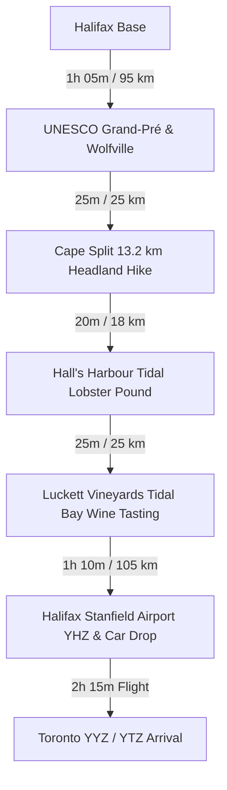

# 🍷 Day 6: Optional Post-Trip Extension — Bay of Fundy Tides, Wine Country & Toronto Departure

!!! info "Travel Buffer Extension Day (Flexible Date: Thursday Oct 15 or Friday Oct 16, 2026)"
    **Base Camp**: Annapolis Valley or Airport Transit  
    **Total Driving Distance**: ~190 km to ~240 km (Halifax → Annapolis Valley / Fundy → YHZ Airport)  
    **Primary Goal**: Take advantage of lower midweek return airfare to Toronto, hike the magnificent **Cape Split Trail** above the Bay of Fundy's world-record tides, tour **Annapolis Valley Wine Country**, and catch an evening flight back to Toronto.

---

## 🗺️ Route Map & Overview

Extending your trip by 24–48 hours past the core itinerary lets you capture substantial flight savings on flights back to Toronto while witnessing the highest tides on planet Earth and the world-class cool-climate vineyards of the Annapolis Valley.

---

## ⏱️ Detailed Timeline & Activity Breakdown

### 08:30 AM – 10:00 AM: Drive to Annapolis Valley & UNESCO Grand-Pré
- **08:30 AM – 09:35 AM**: Depart Halifax via NS-101 W through the lush agricultural Annapolis Valley to **Wolfville / Grand-Pré** (90 km).
- **09:35 AM – 10:30 AM**: **Grand-Pré National Historic Site (UNESCO)**
  - **Location**: 2205 Grand-Pré Rd, Grand-Pré (45.1092° N, 64.3106° W).
  - **Exertion vs Lounging**: 1.0 km gentle park walk (30 mins) + 25 mins memorial church & dykeland viewing.
  - **Highlights**: Commemorates the Acadian settlement, their ingenious 17th-century wooden aboiteau dyke systems reclaiming land from the massive Fundy tides, and the 1755 Deportation.
  - **Direct Guide**: [Parks Canada Grand-Pré NHS](https://parks.canada.ca/lhn-nhs/ns/grandpre)

---

### 11:00 AM – 03:00 PM: Choose Your Fundy Adventure

#### Option 1: Cape Split Provincial Park Hike (The Ultimate Coastal Headland)
*Recommended for active hikers wanting high-drama cliff views over churning tidal waters.*
- **Trailhead**: 4340 Scots Bay Rd, Scots Bay (45.3341° N, 64.4988° W - paved parking with restrooms).
- **Trail Specifications**: 13.2 km return | 310 m elevation gain | 3.5 – 4.0 hours duration.
- **Granular Breakdown**:
  - **11:00 AM – 12:45 PM (Active Exertion - 6.6 km hike out)**: Well-graded forest trail through mossy birch, spruce, and maple woodlands.
  - **12:45 PM – 01:30 PM (Stationary Viewpoint & Cliffside Lunch)**: Reach the dramatic 60-meter sheer basalt cliffs extending into the Minas Channel. Watch the immense tidal surge of 160 billion tonnes of seawater rushing in, creating giant whirlpools and roaring rapids below.
  - **01:30 PM – 03:00 PM (Active Exertion - 6.6 km return)**: Steady pace back to the trailhead parking.
- **Direct Guide**: [Nova Scotia Parks Cape Split](https://parks.novascotia.ca/park/cape-split) | [AllTrails Cape Split](https://www.alltrails.com/trail/canada/nova-scotia/cape-split-trail)

#### Option 2: Hall's Harbour & Low Tide Ocean Floor Exploration
*Recommended for a relaxed afternoon admiring fishing boats grounded on the harbor mud.*
- **Location**: 1157 W Halls Harbour Rd, Halls Harbour.
- **Exertion vs Lounging**: 1.0 km gentle beach and wharf walk (30 mins) + 1.5 hours watching the tide drop up to 12 meters (40 feet) while enjoying fresh lobster on the wharf.
- **Direct Guide**: [Hall's Harbour Tourism](https://www.novascotia.com/places-to-go/regions/bay-of-fundy-annapolis-valley/halls-harbour)

---

### 03:30 PM – 05:30 PM: Annapolis Valley Vineyard Tasting
- **03:30 PM – 05:15 PM**: **Luckett Vineyards / Gaspereau Valley Wine Trail**
  - **Location**: 1293 Grand Pré Rd, Wolfville (45.0686° N, 64.3311° W).
  - **Exertion vs Lounging**: 15 mins vineyard rows stroll + 1 hour wine tasting and charcuterie on the barrel cellar patio.
  - **Highlights**: Taste Nova Scotia’s signature appellation wine, **Tidal Bay** (crisp, aromatic white wine crafted to pair perfectly with local seafood). Place a free phone call anywhere in North America from the vintage red phone box standing in the middle of the vines!
  - **Direct Guide**: [Luckett Vineyards Official Site](https://luckettvineyards.com/)

---

### 05:30 PM – 07:15 PM: Transit to Halifax Stanfield Airport (YHZ)
- **05:30 PM – 06:45 PM**: Drive 105 km east via NS-101 E and NS-102 N directly to **Halifax Stanfield International Airport (YHZ)**.
- **06:45 PM – 07:15 PM**: Refuel rental car and return keys at the airport rental garage.
- **07:15 PM – 09:30 PM**: Pass security, enjoy a final Nova Scotia craft pint at the departure gate, and board your evening non-stop flight back to Toronto (YYZ / YTZ).

---

## 🍽️ Dining & Restaurant Options

1. **The Lobster Pound & Restaurant at Hall's Harbour** *(Hall's Harbour)*  
   - **Drive / Walk**: Right on the wharf  
   - **Food Type**: Working tidal lobster wharf & seafood pound  
   - **Price**: $$–$$$ ($24–$48 CAD)  
   - **Google Maps**: [Halls Harbour Lobster Pound](https://maps.google.com/?q=Halls+Harbour+Lobster+Pound)  
   - **Why Recommended**: Choose your live lobster straight from the seawater holding tanks, cooked to order while you watch fishing vessels rest on the harbor floor at low tide.

2. **Bistro 22** *(Wolfville Main Street)*  
   - **Drive / Walk**: In central Wolfville  
   - **Food Type**: Locally sourced seasonal Annapolis Valley bistro  
   - **Price**: $$–$$$ ($22–$38 CAD)  
   - **Google Maps**: [Bistro 22 Wolfville](https://maps.google.com/?q=Bistro+22+Wolfville)  
   - **Why Recommended**: Intimate dining showcasing valley produce, Digby scallops with corn puree, and valley duck breast.

3. **Luckett Vineyards Crush Pad Bistro** *(Gaspereau Valley)*  
   - **Drive / Walk**: 8-min drive from Wolfville  
   - **Food Type**: Vineyard bistro, local artisan charcuterie & cheese boards  
   - **Price**: $$–$$$ ($20–$36 CAD)  
   - **Google Maps**: [Luckett Vineyards](https://maps.google.com/?q=Luckett+Vineyards+Wolfville)  
   - **Why Recommended**: Open-air dining terrace with sweeping views of the Minas Basin and Blomidon ridge.

4. **Church Brewing Company** *(Wolfville)*  
   - **Drive / Walk**: Downtown Wolfville  
   - **Food Type**: Elevated gastropub inside a restored 1914 stone church  
   - **Price**: $$ ($18–$30 CAD)  
   - **Google Maps**: [The Church Brewing Company](https://maps.google.com/?q=The+Church+Brewing+Company+Wolfville)  
   - **Why Recommended**: Spectacular soaring cathedral ceilings, stained glass windows, outstanding wood-fired pizzas, and fresh craft IPAs and stouts.

5. **Le Caveau Restaurant at Domaine de Grand Pré** *(Grand-Pré)*  
   - **Drive / Walk**: Beside Grand-Pré NHS  
   - **Food Type**: High-end French-Maritime fine dining winery restaurant  
   - **Price**: $$$–$$$$ ($35–$60 CAD)  
   - **Google Maps**: [Le Caveau Restaurant Grand Pre](https://maps.google.com/?q=Le+Caveau+Grand+Pre)  
   - **Why Recommended**: Named one of the world's best winery restaurants by *Wine Access*; exceptional multi-course wine pairings.

6. **Maritime Ale House / Millstone Public House** *(Airport Transit / Bedford area)*  
   - **Drive / Walk**: 15 min from YHZ Airport  
   - **Food Type**: Convenient pre-flight pub meal & local seafood  
   - **Price**: $$ ($18–$28 CAD)  
   - **Google Maps**: [Millstone Public House Bedford](https://maps.google.com/?q=Millstone+Public+House+Bedford+NS)  
   - **Why Recommended**: Easy and stress-free pub dining just off Highway 102 on the final drive to the airport.

---

## 🎒 Gear & Day Preparation
- **Mud-Resistant Hiking Boots**: Cape Split trail can have muddy clay sections after rain; bring a plastic grocery bag to store muddy shoes in your luggage before the flight.
- **Wine Packaging**: If buying wine at the vineyards, make sure it is packed securely inside your checked luggage (or purchase certified shipping boxes).
